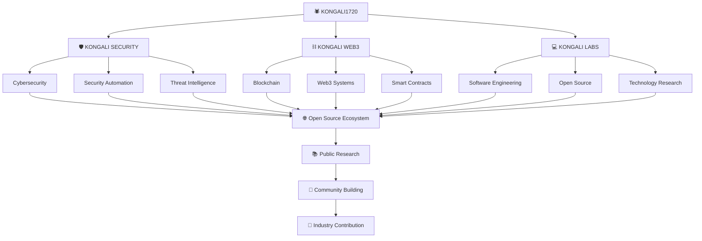

# 🕷️ KONGALI SECURITY

### Open-Source Cybersecurity & Security Automation Framework

**Secure. Analyze. Automate.**

 

---

## 🕷️ About Kongali Security

**Kongali Security** is an open-source cybersecurity and security automation framework designed to help security professionals, developers, system administrators, researchers, and IT teams perform defensive security analysis and automate repetitive security workflows.

The project is designed around a modular architecture that brings together:

- 🔎 Threat Intelligence
- 🧩 IOC Analysis
- #️⃣ Hash Analysis
- 🌐 DNS Intelligence
- 🕵️ OSINT Workflows
- 📡 Network Monitoring
- 📜 Log Analysis
- 🛡️ File Integrity Monitoring
- 🧬 YARA-Based Analysis
- 🤖 AI-Assisted Security Analysis
- 📊 Security Reporting
- ⚙️ Security Automation

Kongali Security is being developed as part of the broader **KONGALI1720 technology ecosystem**, with a long-term focus on open-source software engineering, cybersecurity research, automation, and defensive security tooling.

---

## 🎯 Vision

> **To build an open-source security platform that makes cybersecurity analysis, monitoring, and automation more accessible, modular, transparent, and extensible.**

Kongali Security aims to evolve from a collection of security utilities into a modular security framework that can be extended by developers, security researchers, system administrators, and the wider open-source community.

---

## 🚀 Mission

Kongali Security is built around several core objectives:

1. Build modular and maintainable security tooling.
2. Automate repetitive defensive security workflows.
3. Improve accessibility of security analysis tools.
4. Provide structured and machine-readable security results.
5. Support integration with existing security workflows.
6. Encourage responsible security research.
7. Build a collaborative open-source cybersecurity ecosystem.

---

# 🧠 Core Architecture

    ┌─────────────────────────────────────────────┐
    │              KONGALI SECURITY               │
    │          Secure. Analyze. Automate.         │
    └──────────────────────┬──────────────────────┘
                           │
                           ▼
    ┌─────────────────────────────────────────────┐
    │             CORE SECURITY ENGINE            │
    └──────────────────────┬──────────────────────┘
                           │
           ┌───────────────┼───────────────┐
           │               │               │
           ▼               ▼               ▼
    ┌────────────┐  ┌────────────┐  ┌────────────┐
    │THREAT INTEL│  │    OSINT   │  │ MONITORING │
    └─────┬──────┘  └─────┬──────┘  └─────┬──────┘
          │               │               │
          ├── IOC         ├── DNS         ├── Network
          ├── Hash        ├── WHOIS       ├── Logs
          ├── URL         ├── Domain      └── Events
          └── Reputation  └── Metadata
          │               │               │
          └───────────────┼───────────────┘
                          │
                          ▼
    ┌─────────────────────────────────────────────┐
    │               ANALYSIS ENGINE               │
    └──────────────────────┬──────────────────────┘
                           │
              ┌────────────┼────────────┐
              │            │            │
              ▼            ▼            ▼
          ┌───────┐    ┌───────┐    ┌───────────┐
          │ Rules │    │ YARA  │    │ Detection │
          └───────┘    └───────┘    └───────────┘
              │            │            │
              └────────────┼────────────┘
                           │
                           ▼
    ┌─────────────────────────────────────────────┐
    │             SECURITY AUTOMATION             │
    └──────────────────────┬──────────────────────┘
                           │
                           ▼
    ┌─────────────────────────────────────────────┐
    │                 AI-SOC LAYER                │
    │              Human-in-the-Loop              │
    └──────────────────────┬──────────────────────┘
                           │
                           ▼
    ┌─────────────────────────────────────────────┐
    │              REPORTING & EXPORT             │
    └──────────────────────┬──────────────────────┘
                           │
                    ┌──────┼──────┐
                    ▼      ▼      ▼
                   JSON    CSV    HTML
                    │      │      │
                    └──────┼──────┘
                           │
                           ▼
    ┌─────────────────────────────────────────────┐
    │                WEB DASHBOARD                │
    └─────────────────────────────────────────────┘

---

# 🧩 Key Features

## 🔎 Threat Intelligence

Analyze and process security indicators including:

- IPv4 addresses
- IPv6 addresses
- Domains
- URLs
- File hashes
- IOC collections
- Threat intelligence data

Future integrations may support external threat intelligence providers through a modular plugin architecture.

---

## 🧬 IOC Analysis

Kongali Security provides a foundation for identifying and classifying common Indicators of Compromise.

Supported IOC categories include:

- IPv4
- IPv6
- Domain
- URL
- MD5
- SHA-1
- SHA-256

Example workflow:

    Input
      │
      ▼
    IOC Analyzer
      │
      ├── Identify
      ├── Classify
      ├── Normalize
      └── Enrich
            │
            ▼
        Security Result

---

## #️⃣ Hash Analysis

Analyze cryptographic hashes and identify their likely type.

Supported hash families include:

- MD5
- SHA-1
- SHA-256
- SHA-512

The hash analysis layer is designed to be extensible for future integrations with security intelligence systems.

---

## 🌐 DNS Intelligence

The DNS module provides defensive DNS analysis capabilities.

Planned capabilities include:

- DNS record lookup
- A / AAAA records
- MX records
- NS records
- TXT records
- CNAME records
- Domain resolution
- DNS intelligence workflows

---

## 🕵️ OSINT

Kongali Security aims to provide modular OSINT capabilities for authorized defensive security investigations.

Potential modules include:

- DNS intelligence
- WHOIS information
- Domain analysis
- Subdomain discovery
- Metadata analysis
- Public information correlation

All OSINT features should be used responsibly and in accordance with applicable laws and authorization requirements.

---

## 📡 Network Monitoring

Future network security capabilities may include:

- Network connection monitoring
- Service visibility
- Connection analysis
- Event correlation
- Network anomaly indicators
- Defensive monitoring workflows

The goal is to provide visibility into systems that the operator owns or is explicitly authorized to monitor.

---

## 📜 Log Analysis

Kongali Security is designed to support automated analysis of security-relevant logs.

Potential capabilities:

- Log parsing
- Event classification
- Pattern detection
- Suspicious activity identification
- Security event summarization
- Structured reporting

---

## 🛡️ File Integrity Monitoring

The framework is planned to support file integrity monitoring for authorized systems.

Potential capabilities:

- File hashing
- Baseline creation
- Change detection
- Integrity verification
- Alert generation

---

## 🧬 YARA Analysis

Kongali Security may integrate YARA-based analysis for defensive malware and threat research workflows.

Potential use cases include:

- Malware analysis
- Threat hunting
- File classification
- Security research
- Detection engineering

---

# 🤖 AI-SOC Assistant

The AI-SOC layer is designed to assist security analysts rather than replace human decision-making.

    SECURITY EVENT
          │
          ▼
    DETECTION ENGINE
          │
          ▼
       AI-SOC
          │
      ┌───┼───┐
      │   │   │
      ▼   ▼   ▼
    Explain
    Summarize
    Enrich
      │
      └───────┐
              ▼
        HUMAN ANALYST
              │
              ▼
        FINAL DECISION

The project follows a **Human-in-the-Loop** approach.

AI-assisted features should provide context, explanations, enrichment, and recommendations while keeping final security decisions under human control.

---

# 🏗️ Project Structure

The project is designed around a modular Python architecture.

    kongali-security/
    │
    ├── .github/
    │   ├── workflows/
    │   │   ├── ci.yml
    │   │   └── security.yml
    │   ├── ISSUE_TEMPLATE/
    │   └── pull_request_template.md
    │
    ├── docs/
    │   ├── architecture.md
    │   ├── installation.md
    │   ├── configuration.md
    │   ├── cli.md
    │   ├── modules.md
    │   └── security-model.md
    │
    ├── examples/
    │
    ├── kongali_security/
    │   ├── core/
    │   ├── threat_intel/
    │   ├── osint/
    │   ├── analysis/
    │   ├── network/
    │   ├── reporting/
    │   └── cli/
    │
    ├── tests/
    │
    ├── CHANGELOG.md
    ├── CODE_OF_CONDUCT.md
    ├── CONTRIBUTING.md
    ├── LICENSE
    ├── README.md
    ├── SECURITY.md
    ├── pyproject.toml
    └── requirements.txt

---

# ⚙️ Installation

> **Note:** Kongali Security is currently under active development. Installation and CLI interfaces may change before the first stable release.

## Requirements

- Python 3.10+
- pip
- Git

Clone the repository:

    git clone https://github.com/kongali1720/kongali-security.git

Enter the project directory:

    cd kongali-security

Create a virtual environment:

    python3 -m venv .venv

Activate the environment on Linux/macOS:

    source .venv/bin/activate

Activate the environment on Windows:

    .venv\Scripts\activate

Install the project:

    pip install -e .

---

# 💻 Command Line Interface

The planned CLI interface follows a modular command structure.

Display help:

    kongali-security --help

IOC analysis:

    kongali-security ioc example.com

Hash analysis:

    kongali-security hash <HASH>

DNS analysis:

    kongali-security dns example.com

JSON output:

    kongali-security ioc example.com --format json

> CLI commands are subject to change during the v0.x development cycle.

---

# 📊 Standard Security Result

Kongali Security aims to provide consistent machine-readable output.

Example:

    {
      "tool": "kongali-security",
      "version": "0.1.0",
      "module": "ioc_analyzer",
      "timestamp": "2026-07-22T00:00:00Z",
      "input": "example.com",
      "type": "domain",
      "findings": [],
      "risk": "low",
      "confidence": 0.99
    }

A standardized result format allows security modules to be integrated into larger automation pipelines.

---

# 🔌 Plugin Architecture

Kongali Security is intended to evolve toward an extensible plugin architecture.

    KONGALI SECURITY
           │
           ▼
      PLUGIN ENGINE
           │
       ┌───┼───┐
       │   │   │
       ▼   ▼   ▼
      DNS IOC Threat
    Plugin Plugin Intel
                  Plugin
       │   │   │
       └───┼───┘
           │
           ▼
    Security Results

Future plugins may provide:

- Threat intelligence providers
- Security scanners
- Log processors
- SIEM integrations
- External APIs
- Custom detection modules

---

# 🔐 Security Philosophy

Kongali Security follows a **Defensive Security First** philosophy.

The project focuses on:

- Detection
- Monitoring
- Analysis
- Threat Intelligence
- Security Automation
- Incident Response
- Defensive Research

The framework is intended for:

- Authorized security testing
- Systems owned by the operator
- Systems where explicit permission has been granted
- Defensive security research
- Educational environments

Users are responsible for complying with all applicable laws and regulations.

---

# 🛡️ Responsible Disclosure

If you discover a security vulnerability in Kongali Security, please follow the responsible disclosure process described in:

[SECURITY.md](SECURITY.md)

Please do not publicly disclose sensitive vulnerabilities before maintainers have had an opportunity to investigate and address them.

---

# 🧪 Testing

The project uses automated tests to maintain reliability and code quality.

Run the test suite:

    pytest

Run with verbose output:

    pytest -v

Future CI pipelines will automatically validate:

- Python compatibility
- Unit tests
- Code quality
- Security checks
- Package integrity

---

# 🔄 Development Roadmap

## v0.1.0 — Foundation

- [x] Project initialization
- [ ] Core Security Engine
- [ ] CLI foundation
- [ ] IOC Analyzer
- [ ] Hash Analyzer
- [ ] DNS Module
- [ ] JSON Reporter
- [ ] Initial Unit Tests
- [ ] GitHub Actions CI

---

## v0.2.0 — Threat Intelligence

- [ ] IOC normalization
- [ ] IOC enrichment
- [ ] URL analysis
- [ ] Domain intelligence
- [ ] Threat intelligence adapters
- [ ] Reputation engine

---

## v0.3.0 — OSINT & Network

- [ ] DNS intelligence
- [ ] WHOIS integration
- [ ] Subdomain analysis
- [ ] Network monitoring
- [ ] Service visibility
- [ ] Network event analysis

---

## v0.4.0 — Detection Engine

- [ ] Detection rules
- [ ] Log analysis
- [ ] YARA integration
- [ ] File integrity monitoring
- [ ] Security event correlation

---

## v0.5.0 — AI-SOC

- [ ] AI-assisted analysis
- [ ] IOC enrichment
- [ ] Alert summarization
- [ ] Security event explanation
- [ ] Human-in-the-loop workflows

---

## v1.0.0 — Stable Release

- [ ] Stable API
- [ ] Stable CLI
- [ ] Plugin architecture
- [ ] Comprehensive documentation
- [ ] Production-ready security model
- [ ] Community contribution ecosystem

---

# 🗺️ Long-Term Vision

    KONGALI1720
         │
         ▼
    KONGALI SECURITY
         │
         ├── Threat Intelligence
         ├── OSINT
         ├── Security Automation
         ├── Detection Engineering
         ├── Network Security
         ├── AI-SOC
         └── Security Research
         │
         ▼
      OPEN SOURCE
         │
         ▼
      COMMUNITY
         │
         ▼
    PUBLIC RESEARCH
         │
         ▼
  TECHNICAL PUBLICATIONS
         │
         ▼
  INDUSTRY CONTRIBUTION

The long-term goal is to build a transparent and community-driven cybersecurity ecosystem.

---

# 🤝 Contributing

Contributions are welcome.

Before contributing, please read:

- [CONTRIBUTING.md](CONTRIBUTING.md)
- [CODE_OF_CONDUCT.md](CODE_OF_CONDUCT.md)
- [SECURITY.md](SECURITY.md)

Possible contribution areas include:

- Python development
- Security engineering
- Threat intelligence
- OSINT research
- Detection engineering
- Documentation
- Testing
- DevOps
- CI/CD
- AI-assisted security research

We welcome developers, security researchers, system administrators, students, and open-source contributors.

---

# 📚 Documentation

Project documentation will be expanded as the framework evolves.

Planned documentation:

    docs/
    ├── architecture.md
    ├── installation.md
    ├── configuration.md
    ├── cli.md
    ├── modules.md
    └── security-model.md

---

# 🏆 Project Goals

Kongali Security aims to become:

    Accessible
         +
    Modular
         +
    Secure
         +
    Extensible
         +
    Open Source
         +
    Community Driven

The project is being developed with a long-term goal of becoming a useful contribution to the cybersecurity and open-source ecosystem.

---

# 🌐 KONGALI1720 TECHNOLOGY ECOSYSTEM

Kongali Security is part of the broader **KONGALI1720 technology ecosystem**, focused on cybersecurity, blockchain technology, software engineering, open-source development, and public technical research.

---

# 📜 License

Kongali Security is released under the **MIT License**.

See the [LICENSE](LICENSE) file for details.

---

# ⚠️ Disclaimer

Kongali Security is provided for legitimate defensive security, authorized testing, research, and educational purposes.

The maintainers are not responsible for misuse of the software.

Users must ensure that they have appropriate authorization before analyzing systems, networks, domains, or data.

Always comply with applicable laws, regulations, contracts, and organizational security policies.

---

# 🕷️ About the Project

**Kongali Security** is developed under the **KONGALI1720** technology identity with a focus on:

- Cybersecurity
- Blockchain
- Software Engineering
- Open Source
- Security Automation
- Research

The project is built with a long-term vision:

> **Build useful technology. Share knowledge. Improve security. Contribute to open source.**

---

# 🕷️ KONGALI SECURITY

### Secure. Analyze. Automate.

**Built for Defensive Security & Open Source**

 

[⭐ Star the Repository](https://github.com/kongali1720/kongali-security)

[🐛 Report an Issue](https://github.com/kongali1720/kongali-security/issues)

[🤝 Contribute](https://github.com/kongali1720/kongali-security/pulls)

 

**KONGALI1720 © 2026**

