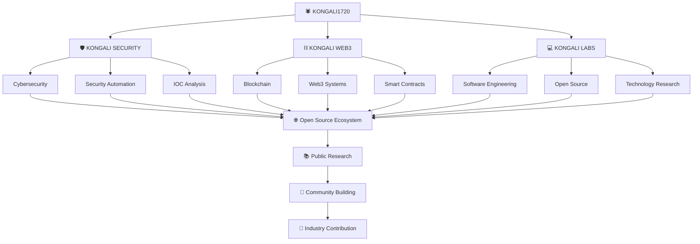

<p align="center">
  
</p>

<div align="center">

# 🕷️ KONGALI SECURITY

### Open-Source Defensive Security Analysis & Automation Framework

**Secure. Analyze. Automate.**

[](https://github.com/kongali1720)
[](https://github.com/kongali1720/kongali-security)
[](https://www.python.org/)
[](LICENSE)
[](https://github.com/kongali1720/kongali-security/releases)
[](https://github.com/kongali1720/kongali-security)
[](SECURITY.md)

<br>

[](https://github.com/kongali1720/kongali-security/stargazers)
[](https://github.com/kongali1720/kongali-security/network/members)
[](https://github.com/kongali1720/kongali-security/issues)
[](https://github.com/kongali1720/kongali-security/pulls)
[](https://github.com/kongali1720/kongali-security/commits/main)
[](https://www.python.org/)

</div>

---

<p align="center">
  
</p>

---

# 🕷️ About Kongali Security

**Kongali Security** is an open-source defensive security analysis and automation framework written in Python.

The project is designed to provide a modular foundation for security professionals, developers, system administrators, researchers, students, and IT teams who need practical tools for defensive security analysis and automation.

The current `v0.1.0` release provides a functional command-line interface and local Indicator of Compromise (IOC) classification capabilities.

The long-term vision is to evolve Kongali Security into a broader modular cybersecurity ecosystem covering:

* IOC analysis
* Threat intelligence
* OSINT
* Network monitoring
* Detection engineering
* Security automation
* Security reporting
* AI-assisted security analysis
* SOC workflows

The current implementation should always be distinguished from future roadmap capabilities.

---

# 📌 Project Status

> **Current Release: v0.1.0 — Active Development**

Kongali Security is currently in an early-stage `0.x` development cycle.

The current release provides a working foundation with:

* Functional Python package
* Command-line interface
* IOC classification engine
* Text output
* JSON output
* IPv4 detection
* IPv6 detection
* Domain detection
* URL detection
* MD5 detection
* SHA-1 detection
* SHA-256 detection
* SHA-512 detection
* Automated unit tests
* CI workflow
* Security automation workflow
* Python package build support

The public API, CLI interface, internal architecture, and module structure may evolve during the `0.x` development cycle.

---

# 📊 Implementation Status

| Capability                     | Status        |
| ------------------------------ | ------------- |
| Python Package                 | ✅ Implemented |
| CLI Entry Point                | ✅ Implemented |
| `--help`                       | ✅ Implemented |
| `--version`                    | ✅ Implemented |
| IOC Analyzer                   | ✅ Implemented |
| IPv4 Detection                 | ✅ Implemented |
| IPv6 Detection                 | ✅ Implemented |
| Domain Detection               | ✅ Implemented |
| URL Detection                  | ✅ Implemented |
| MD5 Detection                  | ✅ Implemented |
| SHA-1 Detection                | ✅ Implemented |
| SHA-256 Detection              | ✅ Implemented |
| SHA-512 Detection              | ✅ Implemented |
| Text Output                    | ✅ Implemented |
| JSON Output                    | ✅ Implemented |
| IOC Unit Tests                 | ✅ Implemented |
| CI Workflow                    | ✅ Implemented |
| Security Workflow              | ✅ Implemented |
| Python Package Build           | ✅ Implemented |
| Threat Intelligence Enrichment | 🔄 Planned    |
| OSINT Modules                  | 🔄 Planned    |
| Network Monitoring             | 🔄 Planned    |
| Log Analysis                   | 🔄 Planned    |
| YARA Integration               | 🔄 Planned    |
| File Integrity Monitoring      | 🔄 Planned    |
| AI-SOC                         | 🔄 Planned    |
| Plugin Architecture            | 🔄 Planned    |
| Web Dashboard                  | 🔄 Planned    |

---

# 🎯 Vision

> **To build an open-source security platform that makes cybersecurity analysis, monitoring, and automation more accessible, modular, transparent, and extensible.**

Kongali Security aims to provide a foundation where developers, security researchers, system administrators, and the wider open-source community can build, integrate, test, and improve defensive security capabilities.

---

# 🚀 Mission

Kongali Security is built around the following objectives:

1. Build modular and maintainable security tooling.
2. Automate repetitive defensive security workflows.
3. Improve accessibility of security analysis capabilities.
4. Provide structured and machine-readable security results.
5. Support integration with existing security workflows.
6. Encourage responsible security research.
7. Promote secure software development practices.
8. Build a collaborative open-source cybersecurity ecosystem.

---

# 🧠 Current Architecture

The current implementation is intentionally smaller than the long-term vision.

```text
┌───────────────────────────────────────────────┐
│              KONGALI SECURITY v0.1.0          │
│           Secure. Analyze. Automate.          │
└───────────────────────┬───────────────────────┘
                        │
                        ▼
┌───────────────────────────────────────────────┐
│                  CLI ENTRY POINT              │
│              kongali-security                 │
└───────────────────────┬───────────────────────┘
                        │
             ┌──────────┼──────────┐
             │          │          │
             ▼          ▼          ▼
          IOC        HASH        DNS
       Analysis    Analysis    Analysis
             │
             ▼
┌───────────────────────────────────────────────┐
│                 IOC ANALYZER                  │
├───────────────────────────────────────────────┤
│ IPv4 │ IPv6 │ Domain │ URL │ MD5 │ SHA-1     │
│ SHA-256 │ SHA-512 │ Unknown Classification   │
└───────────────────────┬───────────────────────┘
                        │
                        ▼
┌───────────────────────────────────────────────┐
│                 IOC RESULT                    │
├───────────────────────────────────────────────┤
│ Value │ Type │ Confidence │ Valid │ Metadata │
└───────────────────────┬───────────────────────┘
                        │
                 ┌──────┴──────┐
                 ▼             ▼
              TEXT           JSON
```

The architecture is designed to expand incrementally as additional security modules are implemented and tested.

---

# 🔎 Implemented: IOC Analyzer

The current release includes a local IOC classification engine.

Supported IOC types:

* IPv4
* IPv6
* Domain
* URL
* MD5
* SHA-1
* SHA-256
* SHA-512

The analyzer also supports unknown or invalid input classification.

---

## IOC Analysis Model

```text
Input
  │
  ▼
Normalize Input
  │
  ▼
IP Detection
  │
  ├── IPv4
  └── IPv6
  │
  ▼
Hash Detection
  │
  ├── MD5
  ├── SHA-1
  ├── SHA-256
  └── SHA-512
  │
  ▼
URL Detection
  │
  ▼
Domain Detection
  │
  ▼
Unknown
  │
  ▼
IOCResult
```

The analyzer performs local syntactic classification.

It does not currently contact external threat intelligence providers.

---

# 📋 IOC Result Model

IOC analysis returns structured information containing:

* Original or normalized value
* Detected IOC type
* Confidence score
* Validity status
* Metadata

Example JSON result:

```json
{
  "value": "kongali1720.com",
  "type": "domain",
  "confidence": 0.95,
  "valid": true,
  "metadata": {
    "tld": "com",
    "label_count": 2,
    "length": 15
  }
}
```

---

# ⚠️ Understanding Confidence

The `confidence` field represents the analyzer's confidence in classifying the input type.

It does **not** represent:

* Whether an indicator is malicious.
* Whether an indicator is safe.
* Reputation.
* Threat severity.
* Threat intelligence confidence.
* Trustworthiness.

For example:

```json
{
  "value": "8.8.8.8",
  "type": "ipv4",
  "confidence": 1.0,
  "valid": true
}
```

This means the analyzer is highly confident that the input is a syntactically valid IPv4 address.

It does not mean that the IP address has been determined to be safe or malicious.

Threat intelligence enrichment and reputation analysis are planned for future releases.

---

# 💻 Command Line Interface

Kongali Security provides a command-line interface.

## Show Help

```bash
kongali-security --help
```

## Show Version

```bash
kongali-security --version
```

Expected output:

```text
kongali-security 0.1.0
```

---

# 🔎 IOC CLI

Analyze a domain:

```bash
kongali-security ioc kongali1720.com
```

Example output:

```text
Kongali Security IOC Analyzer
─────────────────────────────
Value       : kongali1720.com
Type        : domain
Confidence  : 0.95
Valid       : True
Metadata    : {'tld': 'com', 'label_count': 2, 'length': 15}
```

Analyze an IPv4 address:

```bash
kongali-security ioc 8.8.8.8
```

Analyze an IPv6 address:

```bash
kongali-security ioc 2001:4860:4860::8888
```

Analyze a URL:

```bash
kongali-security ioc https://example.com/login
```

Analyze an MD5 hash:

```bash
kongali-security ioc d41d8cd98f00b204e9800998ecf8427e
```

---

# 📦 JSON Output

The IOC command supports machine-readable JSON output.

```bash
kongali-security ioc kongali1720.com --format json
```

Example:

```json
{
  "value": "kongali1720.com",
  "type": "domain",
  "confidence": 0.95,
  "valid": true,
  "metadata": {
    "tld": "com",
    "label_count": 2,
    "length": 15
  }
}
```

IPv4 example:

```bash
kongali-security ioc 8.8.8.8 --format json
```

URL example:

```bash
kongali-security ioc https://example.com/login --format json
```

Hash example:

```bash
kongali-security ioc d41d8cd98f00b204e9800998ecf8427e --format json
```

JSON output is intended to support future integrations with:

* Security automation pipelines
* SOC workflows
* SIEM systems
* Python applications
* Log processing
* Security dashboards
* CI/CD workflows
* API integrations

---

# 🧪 Testing

The project currently uses `pytest` for automated testing.

Run the complete test suite:

```bash
pytest -v
```

The current test suite covers IOC classification behavior including:

* IPv4 detection
* IPv6 detection
* Private IPv4 detection
* Private IPv4 rejection
* Localhost detection
* Localhost rejection
* MD5 detection
* SHA-1 detection
* SHA-256 detection
* SHA-512 detection
* Domain detection
* Subdomain detection
* Domain normalization
* Trailing-dot handling
* URL detection
* URL paths
* URL queries
* Empty input
* Whitespace input
* Unknown input
* Multiple IOC analysis
* Result serialization
* Convenience functions
* Case-insensitive hash handling

Current validation result:

```text
24 passed
```

---

# 🛠️ Development Environment

Kongali Security currently targets:

* Python 3.10+
* Linux
* macOS
* Windows environments with Python support

Create a virtual environment:

```bash
python3 -m venv .venv
```

Activate on Linux/macOS:

```bash
source .venv/bin/activate
```

Activate on Windows PowerShell:

```powershell
.venv\Scripts\Activate.ps1
```

Upgrade packaging tools:

```bash
python -m pip install --upgrade pip
```

Install the project:

```bash
python -m pip install -e .
```

---

# 📦 Building the Package

Kongali Security is configured as a Python package.

Build the source distribution and wheel:

```bash
python -m build
```

The build artifacts are generated in:

```text
dist/
├── kongali_security-0.1.0.tar.gz
└── kongali_security-0.1.0-py3-none-any.whl
```

Install the built package locally:

```bash
python -m pip install dist/kongali_security-0.1.0-py3-none-any.whl
```

Verify the installation:

```bash
which kongali-security
```

Then:

```bash
kongali-security --version
```

---

# 🔄 CI/CD

The project includes GitHub Actions workflows for continuous integration and security validation.

Current workflow areas include:

* Automated testing
* Python validation
* Code quality checks
* Security checks
* Dependency-related validation
* Package validation where configured

Workflow files are maintained under:

```text
.github/
└── workflows/
    ├── ci.yml
    └── security.yml
```

CI/CD is considered part of the project's security boundary.

Changes to workflows should be reviewed carefully, particularly:

* Permissions
* Secrets
* Third-party actions
* Dependency versions
* Script execution
* Artifact handling

---

# 🔐 Security Philosophy

Kongali Security follows a **Defensive Security First** philosophy.

The project focuses on:

* Detection
* Monitoring
* Analysis
* Threat intelligence
* Security automation
* Incident response
* Defensive research
* Secure software development

The framework is intended for:

* Authorized security testing
* Systems owned by the operator
* Systems where explicit permission has been granted
* Defensive security research
* Educational environments
* Controlled laboratory environments

Users are responsible for complying with all applicable laws, regulations, contracts, terms of service, and organizational policies.

---

# 🛡️ Security Best Practices

Users and contributors should:

* Never commit API keys or credentials.
* Never commit private keys or authentication tokens.
* Never store production secrets in source code.
* Use environment variables or secure secret-management systems.
* Review dependencies before introducing them.
* Keep dependencies updated.
* Run tests before submitting changes.
* Run linting and security checks where applicable.
* Validate external input.
* Avoid unsafe command execution.
* Treat external data as untrusted.
* Apply least-privilege principles.
* Review CI/CD workflow permissions.
* Protect sensitive configuration files.
* Use authorized environments for security testing.

---

# 🚨 Responsible Disclosure

Security is a core consideration of Kongali Security.

If you discover a potential security vulnerability, please follow the responsible disclosure process described in:

[SECURITY.md](SECURITY.md)

Please do not publicly disclose sensitive vulnerabilities before maintainers have had an opportunity to investigate and address them.

For general questions and non-sensitive issues, please refer to:

* [SUPPORT.md](SUPPORT.md)
* GitHub Issues
* GitHub Discussions, when available

---

# 🏗️ Project Structure

The current repository structure is intentionally minimal and reflects the implemented codebase.

```text
kongali-security/
│
├── .github/
│   └── workflows/
│       ├── ci.yml
│       └── security.yml
│
├── kongali_security/
│   ├── __init__.py
│   │
│   ├── analysis/
│   │   └── ioc.py
│   │
│   └── core/
│       ├── __init__.py
│       └── engine.py
│
├── tests/
│   └── test_ioc.py
│
├── .gitignore
├── ACKNOWLEDGEMENTS.md
├── CHANGELOG.md
├── CITATION.cff
├── CODE_OF_CONDUCT.md
├── CONTRIBUTING.md
├── FAQ.md
├── GLOSSARY.md
├── GOVERNANCE.md
├── LEARNING_PATH.md
├── LICENSE
├── README.md
├── ROADMAP.md
├── SECURITY.md
├── SUPPORT.md
├── pyproject.toml
└── seminar-cyber-BANNER.png
```

The project structure will evolve as additional modules are implemented.

---

# 🔮 Future Architecture

The long-term architecture is intended to grow beyond the current IOC foundation.

```text
                    KONGALI SECURITY
                           │
                           ▼
                  CORE SECURITY ENGINE
                           │
          ┌────────────────┼────────────────┐
          │                │                │
          ▼                ▼                ▼
     IOC ANALYSIS     THREAT INTEL       OSINT
          │                │                │
          └────────────────┼────────────────┘
                           │
                           ▼
                  DETECTION ENGINE
                           │
          ┌────────────────┼────────────────┐
          │                │                │
          ▼                ▼                ▼
        LOGS             YARA              FIM
          │                │                │
          └────────────────┼────────────────┘
                           │
                           ▼
                   SECURITY AUTOMATION
                           │
                           ▼
                       AI-SOC
                 Human-in-the-Loop
                           │
                           ▼
                    REPORTING LAYER
                           │
                           ▼
                    FUTURE DASHBOARD
```

This diagram represents the project's long-term architectural direction.

These components should not be considered implemented in `v0.1.0` unless explicitly documented elsewhere in the repository.

---

# 🧩 Planned Security Domains

The project is intended to expand into several security domains.

## 🔎 Threat Intelligence

Future capabilities may include:

* IOC enrichment
* Reputation analysis
* Threat intelligence adapters
* External intelligence providers
* Indicator correlation

---

## 🕵️ OSINT

Potential future capabilities include:

* DNS intelligence
* WHOIS analysis
* Domain intelligence
* Subdomain analysis
* Metadata analysis
* Public information correlation

All OSINT functionality should be used responsibly and only for authorized purposes.

---

## 📡 Network Security

Future development may include:

* Network monitoring
* Connection analysis
* Service visibility
* Network event analysis
* Defensive anomaly indicators

---

## 📜 Log Analysis

Future capabilities may include:

* Log parsing
* Event classification
* Pattern detection
* Suspicious activity identification
* Event correlation
* Structured security reporting

---

## 🛡️ File Integrity Monitoring

Potential capabilities include:

* File hashing
* Baseline creation
* Change detection
* Integrity verification
* Alert generation

---

## 🧬 YARA Integration

Future YARA capabilities may support:

* Malware analysis
* Threat hunting
* File classification
* Detection engineering
* Security research

---

# 🤖 AI-SOC Vision

The long-term project vision includes an AI-assisted security operations layer.

The intended model is:

```text
SECURITY EVENT
      │
      ▼
DETECTION ENGINE
      │
      ▼
    AI-SOC
      │
 ┌────┼─────────┐
 │    │         │
 ▼    ▼         ▼
Explain Summarize Enrich
 │    │         │
 └────┼─────────┘
      │
      ▼
HUMAN ANALYST
      │
      ▼
FINAL DECISION
```

Kongali Security intends to follow a **Human-in-the-Loop** approach.

AI-generated results should be treated as assistance rather than authoritative security conclusions.

Users should validate AI-generated findings before taking consequential security actions.

AI-SOC capabilities are currently part of the project's long-term roadmap and are not part of the current `v0.1.0` implementation.

---

# 🔌 Plugin Architecture Vision

The project may eventually evolve toward a modular plugin architecture.

Potential future integrations include:

* Threat intelligence providers
* Security scanners
* Log processors
* SIEM systems
* External APIs
* Custom detection modules
* Security automation pipelines

Future plugin systems should follow secure development practices and must not execute untrusted code without explicit authorization and appropriate isolation.

---

# 🗺️ Roadmap

The complete roadmap is maintained in:

[ROADMAP.md](ROADMAP.md)

The following represents the long-term development direction.

## v0.1.x — Foundation

* [x] Project initialization
* [x] Python package
* [x] Core engine foundation
* [x] CLI foundation
* [x] IOC Analyzer
* [x] IPv4 detection
* [x] IPv6 detection
* [x] Domain detection
* [x] URL detection
* [x] MD5 detection
* [x] SHA-1 detection
* [x] SHA-256 detection
* [x] SHA-512 detection
* [x] Text output
* [x] JSON output
* [x] Unit tests
* [x] CI workflow
* [x] Security workflow
* [x] Package build validation

---

## v0.2.x — Threat Intelligence

* [ ] IOC normalization expansion
* [ ] IOC enrichment
* [ ] URL intelligence
* [ ] Domain intelligence
* [ ] Threat intelligence adapters
* [ ] Reputation engine

---

## v0.3.x — OSINT & Network

* [ ] DNS intelligence
* [ ] WHOIS integration
* [ ] Subdomain analysis
* [ ] Network monitoring
* [ ] Service visibility
* [ ] Network event analysis

---

## v0.4.x — Detection Engine

* [ ] Detection rules
* [ ] Log analysis
* [ ] YARA integration
* [ ] File integrity monitoring
* [ ] Security event correlation

---

## v0.5.x — AI-SOC

* [ ] AI-assisted analysis
* [ ] IOC enrichment
* [ ] Alert summarization
* [ ] Security event explanation
* [ ] Human-in-the-loop workflows
* [ ] AI safety and guardrails

---

## v1.0.0 — Stable Release

* [ ] Stable API
* [ ] Stable CLI
* [ ] Plugin architecture
* [ ] Comprehensive documentation
* [ ] Production-ready security model
* [ ] Community contribution ecosystem
* [ ] Versioned result schemas
* [ ] Security hardening review

---

# 🤝 Contributing

Contributions are welcome.

Before opening a Pull Request:

1. Update your branch with the latest `main`.
2. Run the relevant tests.
3. Run linting and security checks where applicable.
4. Review your own changes.
5. Remove debugging code.
6. Ensure no secrets or credentials are included.
7. Update documentation when required.
8. Keep changes focused and clearly described.
9. Follow the project's security and contribution guidelines.

Recommended workflow:

```bash
git checkout main
git pull --rebase origin main
```

Create a feature branch:

```bash
git checkout -b feature/your-feature
```

Run tests:

```bash
pytest -v
```

Run linting where configured:

```bash
ruff check .
```

Build the package where applicable:

```bash
python -m build
```

Review changes:

```bash
git status
git diff
```

Commit changes:

```bash
git add .
git commit -m "feat: describe your change"
```

Before pushing:

```bash
git pull --rebase origin main
```

Push your branch:

```bash
git push origin feature/your-feature
```

Then open a Pull Request against `main`.

Please read:

* [CONTRIBUTING.md](CONTRIBUTING.md)
* [CODE_OF_CONDUCT.md](CODE_OF_CONDUCT.md)
* [GOVERNANCE.md](GOVERNANCE.md)
* [SECURITY.md](SECURITY.md)
* [SUPPORT.md](SUPPORT.md)

---

# 📚 Documentation

Project documentation includes:

* [CONTRIBUTING.md](CONTRIBUTING.md)
* [CODE_OF_CONDUCT.md](CODE_OF_CONDUCT.md)
* [GOVERNANCE.md](GOVERNANCE.md)
* [ROADMAP.md](ROADMAP.md)
* [SECURITY.md](SECURITY.md)
* [SUPPORT.md](SUPPORT.md)
* [CHANGELOG.md](CHANGELOG.md)
* [CITATION.cff](CITATION.cff)
* [FAQ.md](FAQ.md)
* [GLOSSARY.md](GLOSSARY.md)
* [LEARNING_PATH.md](LEARNING_PATH.md)
* [ACKNOWLEDGEMENTS.md](ACKNOWLEDGEMENTS.md)

---

# 🌐 KONGALI1720 Technology Ecosystem

Kongali Security is part of the broader **KONGALI1720 technology ecosystem**, focused on:

* Cybersecurity
* Security automation
* Blockchain technology
* Software engineering
* Open-source development
* Security research
* Public technical knowledge



---

# 🏆 Project Goals

Kongali Security aims to become:

```text
Accessible
    +
Modular
    +
Secure
    +
Extensible
    +
Open Source
    +
Community Driven
    +
Automation Ready
```

The project is being developed with the long-term goal of contributing useful tools, knowledge, research, and engineering practices to the cybersecurity and open-source communities.

---

# 📜 License

Kongali Security is released under the **MIT License**.

See [LICENSE](LICENSE) for the full license text.

---

# ⚠️ Disclaimer

Kongali Security is provided for legitimate defensive security, authorized testing, research, and educational purposes.

The maintainers are not responsible for misuse of the software.

Users must ensure that they have appropriate authorization before analyzing systems, networks, domains, files, or data.

Always comply with applicable laws, regulations, contracts, terms of service, and organizational security policies.

---

# 🕷️ About the Project

**Kongali Security** is developed under the **KONGALI1720** technology identity with a focus on:

* Cybersecurity
* Security Automation
* Software Engineering
* Open Source
* Security Research
* Future Security Intelligence

The project is built around a long-term vision:

> **Build useful technology. Share knowledge. Improve security. Contribute to open source.**

---

<div align="center">

# 🕷️ KONGALI SECURITY

### Secure. Analyze. Automate.

**Built for Defensive Security & Open Source**

<br>

[⭐ Star the Repository](https://github.com/kongali1720/kongali-security)

[🐛 Report an Issue](https://github.com/kongali1720/kongali-security/issues)

[🤝 Contribute](https://github.com/kongali1720/kongali-security/pulls)

<br>

**KONGALI1720 © 2026**

</div>


---

<div align="center">

## ☕ Support the Project

If this project has helped your research, learning, or security operations, consider supporting its continued development.

<div align="center">


<a href="https://www.paypal.com/paypalme/bungtempong99">


</a>

</div>

---
