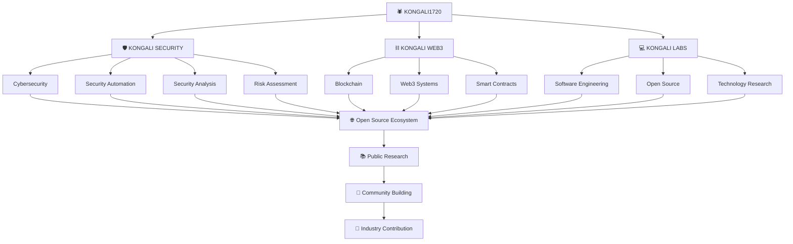

<p align="center">
  
</p>

<div align="center">

# 🕷️ KONGALI SECURITY

### Open-Source Defensive Security Analysis & Automation Framework

**Secure. Analyze. Automate.**

[](https://github.com/kongali1720)
[](https://github.com/kongali1720/kongali-security)
[](https://www.python.org/)
[](LICENSE)
[](https://github.com/kongali1720/kongali-security/releases)
[](https://github.com/kongali1720/kongali-security)
[](SECURITY.md)
[](https://github.com/kongali1720/kongali-security/actions)

<br>

[](https://github.com/kongali1720/kongali-security/stargazers)
[](https://github.com/kongali1720/kongali-security/network/members)
[](https://github.com/kongali1720/kongali-security/issues)
[](https://github.com/kongali1720/kongali-security/pulls)
[](https://github.com/kongali1720/kongali-security/commits/main)
[](.github/workflows/security.yml)

</div>

---

<p align="center">
  
</p>

---

# 🕷️ About Kongali Security

**Kongali Security** is an open-source defensive security analysis and automation framework written in Python.

The project is designed to provide a modular foundation for:

* Security professionals
* Developers
* System administrators
* Security researchers
* Students
* IT teams
* SOC and security operations workflows

Kongali Security combines security analysis, structured findings, risk scoring, standards mapping, reporting, automation, and CI/CD security integration into a single extensible framework.

The project is being actively developed toward a stable **Kongali Security v1.0.0** release.

The long-term vision is to provide a practical defensive security platform covering:

* IOC analysis
* DNS and WHOIS intelligence
* URL analysis
* HTTP security headers
* TLS security analysis
* Security scanning
* Security auditing
* Security baselines
* CVSS risk scoring
* OWASP mapping
* CWE mapping
* Structured security findings
* Unified security assessments
* SARIF security reporting
* HTML reporting
* Markdown reporting
* JSON reporting
* PDF security reports
* GitHub Code Scanning integration
* Security automation
* Threat intelligence
* Detection engineering
* AI-assisted security operations

The current implementation should always be distinguished from future roadmap capabilities.

---

# 📌 Project Status

> **Current Development Track: v0.1.x → v1.0.0**

Kongali Security has evolved beyond its original IOC-only foundation and is now developing toward a unified defensive security assessment platform.

The current codebase includes:

* Functional Python package
* Command-line interface
* IOC analysis
* Hash analysis
* DNS analysis
* WHOIS analysis
* URL analysis
* HTTP security header analysis
* TLS security analysis
* Security scanning
* Security auditing
* Security baseline generation
* Security report generation
* Baseline comparison
* Report export
* CVSS 3.1 risk scoring
* OWASP classification mapping
* CWE classification mapping
* Unified `SecurityFinding` schema
* Unified Assessment Engine
* JSON output
* Text output
* Markdown output
* HTML output
* SARIF output
* PDF output
* GitHub Code Scanning integration
* Automated testing
* CI workflows
* Security workflows
* Python package build support

The project currently operates in the `0.x` development cycle.

The primary objective is to stabilize the architecture, unify security findings, improve test coverage, harden reporting, and establish a reliable API and CLI before declaring **v1.0.0 Stable**.

---

# 🎯 Road to Kongali Security v1.0

The development strategy is centered around one major architectural goal:

```text
Multiple Security Analyzers
          │
          ▼
Unified SecurityFinding Schema
          │
          ▼
     Risk Scoring
       CVSS 3.1
          │
          ▼
   OWASP / CWE Mapping
          │
          ▼
Unified Assessment Engine
          │
          ▼
Multiple Output Formats
          │
 ┌────────┼─────────┬─────────┬─────────┐
 ▼        ▼         ▼         ▼         ▼
TEXT     JSON    MARKDOWN    HTML      SARIF
                                        │
                                        ▼
                                       PDF
          │
          ▼
CI/CD + GitHub Code Scanning
          │
          ▼
     Stable v1.0.0
```

The core architectural direction is to ensure that all security modules eventually produce consistent, machine-readable, standards-aware security findings.

This enables Kongali Security to evolve from a collection of independent utilities into a unified security assessment framework.

---

# 📊 Current Implementation Status

| Capability                       | Status        |
| -------------------------------- | ------------- |
| Python Package                   | ✅ Implemented |
| CLI Entry Point                  | ✅ Implemented |
| `--help`                         | ✅ Implemented |
| `--version`                      | ✅ Implemented |
| IOC Analysis                     | ✅ Implemented |
| Hash Analysis                    | ✅ Implemented |
| IPv4 Detection                   | ✅ Implemented |
| IPv6 Detection                   | ✅ Implemented |
| Domain Detection                 | ✅ Implemented |
| URL Detection                    | ✅ Implemented |
| DNS Analysis                     | ✅ Implemented |
| WHOIS Analysis                   | ✅ Implemented |
| HTTP Security Headers            | ✅ Implemented |
| TLS Analysis                     | ✅ Implemented |
| Security Scanning                | ✅ Implemented |
| Security Audit                   | ✅ Implemented |
| Security Baseline                | ✅ Implemented |
| Baseline Comparison              | ✅ Implemented |
| Security Reporting               | ✅ Implemented |
| Report Export                    | ✅ Implemented |
| CVSS 3.1 Scoring                 | ✅ Implemented |
| OWASP Mapping                    | ✅ Implemented |
| CWE Mapping                      | ✅ Implemented |
| Unified `SecurityFinding` Schema | ✅ Implemented |
| Unified Assessment Engine        | ✅ Implemented |
| Text Output                      | ✅ Implemented |
| JSON Output                      | ✅ Implemented |
| Markdown Output                  | ✅ Implemented |
| HTML Output                      | ✅ Implemented |
| SARIF Output                     | ✅ Implemented |
| PDF Output                       | ✅ Implemented |
| GitHub Code Scanning Integration | ✅ Implemented |
| Automated Unit Tests             | ✅ Implemented |
| CI Workflow                      | ✅ Implemented |
| Security Workflow                | ✅ Implemented |
| Python Package Build             | ✅ Implemented |
| Threat Intelligence Enrichment   | 🔄 Roadmap    |
| External Reputation Providers    | 🔄 Roadmap    |
| Advanced OSINT                   | 🔄 Roadmap    |
| Network Monitoring               | 🔄 Roadmap    |
| Log Analysis                     | 🔄 Roadmap    |
| YARA Integration                 | 🔄 Roadmap    |
| File Integrity Monitoring        | 🔄 Roadmap    |
| AI-SOC                           | 🔄 Roadmap    |
| Plugin Architecture              | 🔄 Roadmap    |
| Web Dashboard                    | 🔄 Roadmap    |

---

# 🏗️ Current Architecture

Kongali Security is moving toward a layered architecture where individual security analyzers feed a unified security finding model.

```text
┌────────────────────────────────────────────────────┐
│                 KONGALI SECURITY                   │
│             Secure. Analyze. Automate.             │
└──────────────────────────┬─────────────────────────┘
                           │
                           ▼
┌────────────────────────────────────────────────────┐
│                    CLI LAYER                       │
│                kongali-security                    │
└──────────────────────────┬─────────────────────────┘
                           │
        ┌──────────────────┼──────────────────┐
        │                  │                  │
        ▼                  ▼                  ▼
      IOC                DNS/WHOIS           URL
    Analysis             Analysis          Analysis
        │                  │                  │
        ├──────────────────┼──────────────────┤
        │                  │                  │
        ▼                  ▼                  ▼
    HEADERS              TLS                SCAN
    Analysis           Analysis            Engine
        │                  │                  │
        └──────────────────┼──────────────────┘
                           │
                           ▼
                 SECURITY AUDIT ENGINE
                           │
                           ▼
                 BASELINE ENGINE
                           │
                           ▼
             ┌─────────────────────────┐
             │   SecurityFinding       │
             │   Unified Schema        │
             ├─────────────────────────┤
             │ ID                      │
             │ Title                   │
             │ Severity                │
             │ Category                │
             │ Description             │
             │ OWASP                   │
             │ CWE                     │
             │ CVSS 3.1                │
             │ Impact                  │
             │ Remediation             │
             │ Evidence                │
             │ References              │
             │ Metadata                │
             └────────────┬────────────┘
                          │
                          ▼
               UNIFIED ASSESSMENT ENGINE
                          │
        ┌─────────────────┼─────────────────┐
        │                 │                 │
        ▼                 ▼                 ▼
      RISK              SUMMARY          FINDINGS
     SCORING            ANALYSIS        CORRELATION
        │                 │                 │
        └─────────────────┼─────────────────┘
                          │
                          ▼
                 REPORTING LAYER
                          │
        ┌─────────┬───────┼───────┬─────────┐
        ▼         ▼       ▼       ▼         ▼
      TEXT      JSON   MARKDOWN  HTML     SARIF
                                            │
                                            ▼
                                           PDF
                          │
                          ▼
                 CI/CD INTEGRATION
                          │
                          ▼
               GITHUB CODE SCANNING
```

---

# 🧩 Security Finding Model

Kongali Security uses a unified security finding architecture.

The goal is to ensure that findings from different security modules can be represented consistently.

Conceptually:

```text
Analyzer
   │
   ▼
SecurityFinding
   │
   ├── ID
   ├── Title
   ├── Severity
   ├── Category
   ├── Description
   ├── OWASP
   ├── CWE
   ├── CVSS
   ├── Impact
   ├── Remediation
   ├── Evidence
   ├── References
   └── Metadata
```

Example:

```python
SecurityFinding(
    id="KONGALI-TLS-001",
    title="Weak TLS Protocol",
    severity="HIGH",
    category="TLS Configuration",
    description="The server uses a weak TLS protocol.",
    owasp=OWASPReference(
        id="A02:2021",
        name="Cryptographic Failures",
    ),
    cwe=CWEReference(
        id="CWE-326",
        name="Inadequate Encryption Strength",
    ),
    cvss=CVSSScore(
        version="3.1",
        score=8.1,
        severity="HIGH",
        vector="CVSS:3.1/AV:N/AC:L/PR:N/UI:N/S:U/C:H/I:L/A:N",
    ),
)
```

The unified schema is intended to provide a stable foundation for future modules and reporting integrations.

---

# 📊 Severity Model

Kongali Security uses the following severity categories:

```text
CRITICAL
HIGH
MEDIUM
LOW
INFO
```

Security findings should use consistent severity values across analyzers.

The severity level represents the assessed security impact of a finding.

It should not be confused with:

* Exploitability alone
* Threat intelligence confidence
* Asset criticality
* Business impact alone
* Proof that exploitation has occurred

---

# 📐 CVSS 3.1 Risk Scoring

Kongali Security includes CVSS 3.1 scoring support.

CVSS metadata may include:

* CVSS version
* Base score
* Severity
* Vector string

Example:

```text
CVSS:3.1/AV:N/AC:L/PR:N/UI:N/S:U/C:H/I:L/A:N
```

Example structured representation:

```json
{
  "version": "3.1",
  "score": 8.1,
  "severity": "HIGH",
  "vector": "CVSS:3.1/AV:N/AC:L/PR:N/UI:N/S:U/C:H/I:L/A:N"
}
```

CVSS is intended to provide a standardized technical risk representation.

Organizations should consider environmental and business context when making security decisions.

---

# 🛡️ OWASP & CWE Mapping

Security findings can be associated with recognized security classifications.

Supported classification concepts include:

* OWASP Top 10
* CWE

Example:

```json
{
  "owasp": {
    "id": "A02:2021",
    "name": "Cryptographic Failures"
  },
  "cwe": {
    "id": "CWE-326",
    "name": "Inadequate Encryption Strength"
  }
}
```

The purpose of classification mapping is to improve:

* Security reporting
* Risk communication
* Compliance documentation
* Developer understanding
* Security education
* Finding correlation

---

# 🔎 IOC Analysis

Kongali Security includes a local IOC classification engine.

Supported IOC types include:

* IPv4
* IPv6
* Domain
* URL
* MD5
* SHA-1
* SHA-256
* SHA-512

Example:

```bash
kongali-security ioc kongali1720.com
```

IPv4:

```bash
kongali-security ioc 8.8.8.8
```

IPv6:

```bash
kongali-security ioc 2001:4860:4860::8888
```

URL:

```bash
kongali-security ioc https://example.com/login
```

MD5:

```bash
kongali-security ioc d41d8cd98f00b204e9800998ecf8427e
```

JSON:

```bash
kongali-security ioc kongali1720.com --format json
```

IOC classification is syntactic analysis.

It does not determine whether an indicator is malicious.

Future releases may introduce external threat intelligence and reputation enrichment.

---

# 🌐 DNS Analysis

Kongali Security provides DNS analysis capabilities.

Example:

```bash
kongali-security dns example.com
```

DNS analysis is intended to support defensive security investigations and domain analysis.

Future development may expand DNS capabilities with:

* Record correlation
* Historical DNS analysis
* Passive DNS integrations
* Security-focused enrichment

---

# 🕵️ WHOIS Analysis

WHOIS analysis provides domain registration information where available.

Example:

```bash
kongali-security whois example.com
```

WHOIS functionality is intended for authorized defensive research and domain analysis.

Future versions may provide improved structured output and correlation.

---

# 🔗 URL Analysis

Kongali Security supports URL analysis.

Example:

```bash
kongali-security url https://example.com
```

Potential analysis areas include:

* URL structure
* Domain
* Scheme
* Path
* Query parameters
* URL metadata

Future releases may expand URL security analysis and reputation enrichment.

---

# 🧱 HTTP Security Headers

Kongali Security includes HTTP security header analysis.

Example:

```bash
kongali-security headers https://example.com
```

The analyzer evaluates security-related HTTP headers such as:

* Content-Security-Policy
* Strict-Transport-Security
* X-Content-Type-Options
* X-Frame-Options
* Referrer-Policy
* Permissions-Policy

Example result concepts:

```text
Security Score
Risk Level
Headers Present
Headers Missing
HTTP Status Code
Reachability
Metadata
```

Security header analysis is intended to identify missing or weak browser security controls.

Future improvements include:

* Header-specific `SecurityFinding` generation
* OWASP mapping
* CWE mapping
* CVSS scoring
* Unified assessment integration

---

# 🔐 TLS Security Analysis

Kongali Security includes TLS analysis.

Example:

```bash
kongali-security tls https://example.com
```

TLS analysis can inspect:

* TLS connection status
* TLS protocol version
* Cipher information
* Cipher strength
* Certificate subject
* Certificate issuer
* Certificate serial number
* Certificate validity
* Subject Alternative Names
* Certificate expiration
* Days remaining

Example:

```text
Target            : https://example.com
Hostname          : example.com
Port              : 443
TLS Version       : TLSv1.3
Cipher            : TLS_AES_256_GCM_SHA384
Cipher Bits       : 256
Certificate       : Valid
```

The TLS analyzer is designed to evolve toward structured security findings for:

* Weak TLS versions
* Weak cipher suites
* Expired certificates
* Certificates approaching expiration
* Certificate validation issues
* TLS configuration weaknesses

---

# 🔍 Security Scanning

Kongali Security provides a security scanning workflow.

Example:

```bash
kongali-security scan https://example.com
```

The scanning layer is intended to combine multiple defensive security checks into a structured assessment.

The long-term goal is to have scanner results normalized into the unified `SecurityFinding` model.

---

# 🛡️ Security Audit

Run a security audit:

```bash
kongali-security audit https://example.com
```

Security audits are intended to aggregate security checks and provide a structured view of potential security weaknesses.

---

# 📏 Security Baseline

Create a security baseline:

```bash
kongali-security baseline https://example.com
```

Baselines are intended to establish a known security state that can be compared against future assessments.

This enables future workflows such as:

```text
Initial Assessment
      │
      ▼
Create Baseline
      │
      ▼
Future Assessment
      │
      ▼
   Compare
      │
      ▼
Detect Security Drift
```

---

# 🔄 Baseline Comparison

Compare security states using:

```bash
kongali-security compare
```

Baseline comparison is intended to identify changes in security posture over time.

Potential use cases include:

* Security regression detection
* Configuration drift
* New findings
* Resolved findings
* Severity changes
* Security posture monitoring

---

# 📋 Unified Assessment Engine

The Unified Assessment Engine combines security analysis into a consolidated assessment model.

Example:

```bash
kongali-security assess https://example.com
```

JSON output:

```bash
kongali-security assess https://example.com \
  --format json \
  --output unified-assessment.json
```

Text output:

```bash
kongali-security assess https://example.com \
  --format text
```

The assessment architecture is designed to consolidate:

```text
  HTTP Headers
       │
       ▼
  TLS Analysis
       │
       ▼
Security Scanning
       │
       ▼
Security Audit
       │
       ▼
Unified Findings
       │
       ▼
CVSS / OWASP / CWE
       │
       ▼
Assessment Summary
```

The Unified Assessment Engine is a major architectural component on the road toward v1.0.

---

# 📄 Security Reporting

Kongali Security supports multiple reporting formats.

Supported formats include:

```text
text
json
markdown
html
sarif
pdf
```

The reporting layer is intended to provide both human-readable and machine-readable security results.

---

## JSON

```bash
kongali-security report https://example.com \
  --format json \
  --output security-report.json
```

JSON is intended for:

* Automation
* APIs
* SIEM integration
* Security pipelines
* Data processing

---

## Markdown

```bash
kongali-security report https://example.com \
  --format markdown \
  --output security-report.md
```

Markdown is useful for:

* Documentation
* GitHub issues
* Security reviews
* Technical reports

---

## HTML

```bash
kongali-security report https://example.com \
  --format html \
  --output security-report.html
```

HTML provides a browser-friendly security report format.

---

## SARIF

```bash
kongali-security report https://example.com \
  --format sarif \
  --output security-report.sarif
```

SARIF is intended for integration with security development workflows and GitHub Code Scanning.

---

## PDF

```bash
kongali-security report https://example.com \
  --format pdf \
  --output security-assessment.pdf
```

The PDF reporting layer generates a structured A4 security assessment document.

Example validation:

```bash
file security-assessment.pdf
```

```bash
pdfinfo security-assessment.pdf
```

The PDF reporting architecture is built using ReportLab.

---

# 🔐 GitHub Code Scanning Integration

Kongali Security includes SARIF-based integration for GitHub Code Scanning workflows.

The intended pipeline is:

```text
    KONGALI SECURITY
           │
           ▼
     Security Scan
           │
           ▼
       Findings
           │
           ▼
         SARIF
           │
           ▼
     GitHub Actions
           │
           ▼
  GitHub Code Scanning
           │
           ▼
Developer Security Feedback
```

This enables security findings to become part of the software development lifecycle.

---

# 🧪 Testing

Kongali Security uses `pytest` for automated testing.

Run the complete test suite:

```bash
pytest -q
```

Current development validation:

```text
76 passed
```

The test suite is continuously expanded as new modules and security engines are introduced.

Testing areas include:

* IOC classification
* Hash detection
* Domain detection
* URL analysis
* DNS functionality
* WHOIS functionality
* Security headers
* TLS analysis
* Security scanning
* Reporting
* Export
* Baselines
* Comparison
* CVSS scoring
* Security findings
* CLI behavior
* Assessment workflows

Before contributing changes, always run:

```bash
pytest -q
```

---

# 🛠️ Development Environment

Kongali Security currently targets:

* Python 3.10+
* Linux
* macOS
* Windows environments with Python support
* WSL-compatible development environments

Create a virtual environment:

```bash
python3 -m venv .venv
```

Activate on Linux/macOS:

```bash
source .venv/bin/activate
```

Activate on Windows PowerShell:

```powershell
.venv\Scripts\Activate.ps1
```

Install the project:

```bash
python -m pip install -e .
```

Verify:

```bash
kongali-security --help
```

---

# 📦 Building the Package

Build the project:

```bash
python -m build
```

Verify the package:

```bash
python -m pip install dist/*.whl
```

Check the installed CLI:

```bash
which kongali-security
```

Then:

```bash
kongali-security --version
```

---

# 🔄 CI/CD

The project includes GitHub Actions workflows for continuous integration and security validation.

Current workflow areas include:

* Automated testing
* Python validation
* Security checks
* Dependency validation
* SARIF security reporting
* GitHub Code Scanning integration
* Package validation where configured

Workflow files are maintained under:

```text
.github/
└── workflows/
    ├── ci.yml
    └── security.yml
```

CI/CD is considered part of the project's security boundary.

Changes to workflows should be reviewed carefully, particularly:

* Permissions
* Secrets
* Third-party actions
* Dependency versions
* Script execution
* Artifact handling

---

# 🔐 Security Philosophy

Kongali Security follows a **Defensive Security First** philosophy.

The project focuses on:

* Detection
* Monitoring
* Analysis
* Risk assessment
* Security automation
* Security reporting
* Incident response support
* Defensive research
* Secure software development

The framework is intended for:

* Authorized security testing
* Systems owned by the operator
* Systems where explicit permission has been granted
* Defensive security research
* Educational environments
* Controlled laboratory environments

Users are responsible for complying with all applicable laws, regulations, contracts, terms of service, and organizational policies.

---

# 🛡️ Security Best Practices

Users and contributors should:

* Never commit API keys or credentials.
* Never commit private keys or authentication tokens.
* Never store production secrets in source code.
* Use environment variables or secure secret-management systems.
* Review dependencies before introducing them.
* Keep dependencies updated.
* Run tests before submitting changes.
* Run linting and security checks where applicable.
* Validate external input.
* Avoid unsafe command execution.
* Treat external data as untrusted.
* Apply least-privilege principles.
* Review CI/CD workflow permissions.
* Protect sensitive configuration files.
* Use authorized environments for security testing.

---

# 🚨 Responsible Disclosure

Security is a core consideration of Kongali Security.

If you discover a potential security vulnerability, please follow the responsible disclosure process described in:

[SECURITY.md](SECURITY.md)

Please do not publicly disclose sensitive vulnerabilities before maintainers have had an opportunity to investigate and address them.

For general questions and non-sensitive issues, please refer to:

* [SUPPORT.md](SUPPORT.md)
* GitHub Issues
* GitHub Discussions, when available

---

# 🏗️ Project Structure

The architecture is actively evolving toward the v1.0 release.

The current repository includes security analysis, schema, reporting, and core components.

A representative structure is:

```text
kongali-security/
│
├── .github/
│   ├── workflows/
│   │   ├── ci.yml
│   │   └── security.yml
│   │
│   ├── CODEOWNERS
│   └── dependabot.yml
│
├── kongali_security/
│   │
│   ├── analysis/
│   │   ├── assessment.py
│   │   ├── headers.py
│   │   ├── pdf_report.py
│   │   ├── tls.py
│   │   └── ...
│   │
│   ├── schemas/
│   │   ├── __init__.py
│   │   └── finding.py
│   │
│   ├── core/
│   │   └── ...
│   │
│   ├── cli.py
│   └── __init__.py
│
├── tests/
│   └── ...
│
├── .gitignore
├── ACKNOWLEDGEMENTS.md
├── CHANGELOG.md
├── CITATION.cff
├── CODE_OF_CONDUCT.md
├── CONTRIBUTING.md
├── FAQ.md
├── GLOSSARY.md
├── GOVERNANCE.md
├── LEARNING_PATH.md
├── LICENSE
├── README.md
├── ROADMAP.md
├── SECURITY.md
├── SUPPORT.md
├── pyproject.toml
└── seminar-cyber-BANNER.png
```

The repository structure will continue to evolve as the v1.0 architecture is finalized.

---

# 🔮 Future Architecture

The long-term architecture is intended to evolve toward a comprehensive defensive security platform.

```text
                    KONGALI SECURITY
                           │
                           ▼
                  CORE SECURITY ENGINE
                           │
        ┌──────────────────┼──────────────────┐
        │                  │                  │
        ▼                  ▼                  ▼
    IOC ANALYSIS       WEB SECURITY       NETWORK
        │                  │              SECURITY
        │                  │                  │
        ▼                  ▼                  ▼
 THREAT INTEL         TLS / HEADERS       MONITORING
        │                  │                  │
        └──────────────────┼──────────────────┘
                           │
                           ▼
                   DETECTION ENGINE
                           │
          ┌────────────────┼────────────────┐
          │                │                │
          ▼                ▼                ▼
        LOGS              YARA              FIM
          │                │                │
          └────────────────┼────────────────┘
                           │
                           ▼
                  SECURITY AUTOMATION
                           │
                           ▼
                       AI-SOC
                   Human-in-the-Loop
                           │
                           ▼
                    REPORTING LAYER
                           │
                           ▼
                    FUTURE DASHBOARD
```

This represents the project's long-term architectural direction.

Components not yet implemented should not be considered part of the current stable feature set.

---

# 🤖 AI-SOC Vision

The long-term project vision includes an AI-assisted security operations layer.

The intended model is:

```text
SECURITY EVENT
      │
      ▼
DETECTION ENGINE
      │
      ▼
    AI-SOC
      │
 ┌────┼─────────┐
 │    │         │
 ▼    ▼         ▼
Explain Summarize Enrich
 │    │         │
 └────┼─────────┘
      │
      ▼
HUMAN ANALYST
      │
      ▼
FINAL DECISION
```

Kongali Security intends to follow a **Human-in-the-Loop** approach.

AI-generated results should be treated as assistance rather than authoritative security conclusions.

Users should validate AI-generated findings before taking consequential security actions.

AI-SOC capabilities remain part of the roadmap toward future releases.

---

# 🔌 Plugin Architecture Vision

The project may eventually evolve toward a modular plugin architecture.

Potential integrations include:

* Threat intelligence providers
* Security scanners
* Log processors
* SIEM systems
* External APIs
* Custom detection modules
* Security automation pipelines

Future plugin systems should follow secure development practices and must not execute untrusted code without explicit authorization and appropriate isolation.

---

# 🗺️ Roadmap to v1.0.0

The complete roadmap is maintained in:

[ROADMAP.md](ROADMAP.md)

The primary development direction is:

## Phase 1 — Security Analysis Foundation

* [x] IOC analysis
* [x] Hash detection
* [x] DNS analysis
* [x] WHOIS analysis
* [x] URL analysis
* [x] HTTP security headers
* [x] TLS analysis
* [x] Security scanning

---

## Phase 2 — Security Intelligence

* [x] Security audit foundation
* [x] Security baseline
* [x] Baseline comparison
* [ ] Advanced IOC enrichment
* [ ] External reputation providers
* [ ] Threat intelligence adapters
* [ ] Threat intelligence correlation

---

## Phase 3 — Unified Security Model

* [x] `SecurityFinding` schema
* [x] Severity model
* [x] CVSS 3.1 scoring
* [x] OWASP mapping
* [x] CWE mapping
* [x] Evidence model
* [x] Remediation metadata
* [ ] Full analyzer normalization
* [ ] Stable versioned finding schema

---

## Phase 4 — Unified Assessment

* [x] Unified Assessment Engine foundation
* [x] Unified assessment CLI
* [x] JSON assessment output
* [x] Text assessment output
* [ ] Full cross-module finding correlation
* [ ] Unified risk aggregation
* [ ] Finding deduplication
* [ ] Assessment regression testing

---

## Phase 5 — Reporting & Integration

* [x] Text reporting
* [x] JSON reporting
* [x] Markdown reporting
* [x] HTML reporting
* [x] SARIF reporting
* [x] PDF reporting
* [x] GitHub Code Scanning integration
* [ ] Advanced PDF customization
* [ ] Report templates
* [ ] Report branding system
* [ ] Assessment-to-report consistency validation

---

## Phase 6 — v0.2.x

* [ ] Expanded IOC enrichment
* [ ] Threat intelligence adapters
* [ ] Improved security findings
* [ ] Expanded analyzer coverage
* [ ] Increased test coverage
* [ ] API stability improvements

---

## Phase 7 — v0.3.x

* [ ] Advanced OSINT
* [ ] DNS intelligence
* [ ] WHOIS enrichment
* [ ] Subdomain analysis
* [ ] Network monitoring
* [ ] Service visibility

---

## Phase 8 — v0.4.x

* [ ] Detection rules
* [ ] Log analysis
* [ ] YARA integration
* [ ] File integrity monitoring
* [ ] Security event correlation

---

## Phase 9 — v0.5.x

* [ ] AI-assisted analysis
* [ ] IOC enrichment
* [ ] Alert summarization
* [ ] Security event explanation
* [ ] Human-in-the-loop workflows
* [ ] AI safety and guardrails

---

## Phase 10 — v1.0.0 Stable

The goal of `v1.0.0` is to establish a stable and reliable security framework.

Target requirements:

* [ ] Stable CLI
* [ ] Stable API
* [ ] Versioned security finding schema
* [ ] Unified analyzer architecture
* [ ] Comprehensive test coverage
* [ ] Security hardening review
* [ ] Comprehensive documentation
* [ ] Production-ready security model
* [ ] Stable reporting interfaces
* [ ] Stable SARIF integration
* [ ] Community contribution ecosystem
* [ ] Plugin architecture foundation
* [ ] Release process documentation
* [ ] Migration policy
* [ ] Backward compatibility policy

---

# 🤝 Contributing

Contributions are welcome.

Before opening a Pull Request:

1. Update your branch with the latest `main`.
2. Run the relevant tests.
3. Run linting and security checks where applicable.
4. Review your own changes.
5. Remove debugging code.
6. Ensure no secrets or credentials are included.
7. Update documentation when required.
8. Keep changes focused and clearly described.
9. Follow the project's security and contribution guidelines.

Recommended workflow:

```bash
git checkout main
git pull --rebase origin main
```

Create a feature branch:

```bash
git checkout -b feature/your-feature
```

Run tests:

```bash
pytest -q
```

Run linting where configured:

```bash
ruff check .
```

Build the package:

```bash
python -m build
```

Review changes:

```bash
git status
git diff
```

Commit changes:

```bash
git add .
git commit -m "feat: describe your change"
```

Before pushing:

```bash
git pull --rebase origin main
```

Push your branch:

```bash
git push origin feature/your-feature
```

Then open a Pull Request against `main`.

Please read:

* [CONTRIBUTING.md](CONTRIBUTING.md)
* [CODE_OF_CONDUCT.md](CODE_OF_CONDUCT.md)
* [GOVERNANCE.md](GOVERNANCE.md)
* [SECURITY.md](SECURITY.md)
* [SUPPORT.md](SUPPORT.md)

---

# 📚 Documentation

Project documentation includes:

* [CONTRIBUTING.md](CONTRIBUTING.md)
* [CODE_OF_CONDUCT.md](CODE_OF_CONDUCT.md)
* [GOVERNANCE.md](GOVERNANCE.md)
* [ROADMAP.md](ROADMAP.md)
* [SECURITY.md](SECURITY.md)
* [SUPPORT.md](SUPPORT.md)
* [CHANGELOG.md](CHANGELOG.md)
* [CITATION.cff](CITATION.cff)
* [FAQ.md](FAQ.md)
* [GLOSSARY.md](GLOSSARY.md)
* [LEARNING_PATH.md](LEARNING_PATH.md)
* [ACKNOWLEDGEMENTS.md](ACKNOWLEDGEMENTS.md)

---

# 🌐 KONGALI1720 Technology Ecosystem

Kongali Security is part of the broader **KONGALI1720 technology ecosystem**, focused on:

* Cybersecurity
* Security automation
* Blockchain technology
* Software engineering
* Open-source development
* Security research
* Public technical knowledge



---

# 🏆 Project Goals

Kongali Security aims to become:

```text
Accessible
    +
Modular
    +
Secure
    +
Extensible
    +
Standards-Aware
    +
Automation Ready
    +
Open Source
    +
Community Driven
```

The project is being developed with the long-term goal of contributing useful tools, knowledge, research, and engineering practices to the cybersecurity and open-source communities.

---

# 📜 License

Kongali Security is released under the **MIT License**.

See [LICENSE](LICENSE) for the full license text.

---

# ⚠️ Disclaimer

Kongali Security is provided for legitimate defensive security, authorized testing, research, and educational purposes.

The maintainers are not responsible for misuse of the software.

Users must ensure that they have appropriate authorization before analyzing systems, networks, domains, files, or data.

Always comply with applicable laws, regulations, contracts, terms of service, and organizational security policies.

---

# 🕷️ About the Project

**Kongali Security** is developed under the **KONGALI1720** technology identity with a focus on:

* Cybersecurity
* Security Automation
* Software Engineering
* Open Source
* Security Research
* Defensive Security Analysis
* Security Intelligence

The project is built around a long-term vision:

> **Build useful technology. Share knowledge. Improve security. Contribute to open source.**

---

<div align="center">

# 🕷️ KONGALI SECURITY

### Secure. Analyze. Automate.

**Built for Defensive Security & Open Source**

<br>

[⭐ Star the Repository](https://github.com/kongali1720/kongali-security)

[🐛 Report an Issue](https://github.com/kongali1720/kongali-security/issues)

[🤝 Contribute](https://github.com/kongali1720/kongali-security/pulls)

<br>

**KONGALI1720 © 2026**

</div>

---

<div align="center">

## ☕ Support the Project

If this project has helped your research, learning, or security operations, consider supporting its continued development.

<a href="https://www.paypal.com/paypalme/bungtempong99">


</a>

</div>

---
