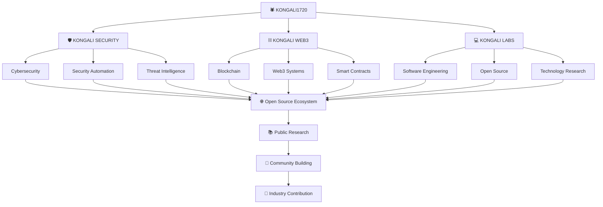

<p align="center">
  
</p>

<div align="center">

# 🕷️ KONGALI SECURITY

### Open-Source Cybersecurity & Security Automation Framework

**Secure. Analyze. Automate.**

[](https://github.com/kongali1720)
[](https://github.com/kongali1720/kongali-security)
[](https://www.python.org/)
[](LICENSE)
[](https://github.com/kongali1720/kongali-security)
[](https://github.com/kongali1720/kongali-security/releases)
[](SECURITY.md)

<br>

[](https://github.com/kongali1720/kongali-security/stargazers)
[](https://github.com/kongali1720/kongali-security/network/members)
[](https://github.com/kongali1720/kongali-security/issues)
[](https://github.com/kongali1720/kongali-security/pulls)
[](https://github.com/kongali1720/kongali-security/commits/main)
[](https://www.python.org/)

</div>

---

<p align="center">
  
</p>

---

# 🕷️ About Kongali Security

**Kongali Security** is an open-source cybersecurity and security automation framework designed to support security professionals, developers, system administrators, researchers, students, and IT teams in performing defensive security analysis and automating repetitive security workflows.

The project is being developed as a modular Python security framework with an emphasis on:

* Defensive security
* Security automation
* IOC analysis
* Threat intelligence
* Secure software development
* Structured security results
* Automated testing
* Continuous integration
* Security validation
* Future AI-assisted security workflows

The long-term objective is to evolve Kongali Security from a collection of security utilities into a modular cybersecurity framework that can integrate with existing security operations and automation pipelines.

---

# 📌 Project Status

> **Current Status: Active Development — v0.1.x**

Kongali Security is currently in the early development stage.

The current repository contains the foundational Python package structure and initial security analysis functionality. The project is actively establishing its packaging, testing, CI/CD, security automation, and contribution infrastructure.

The following areas are currently under active development:

* Python package architecture
* Core security engine
* IOC analysis
* Automated testing
* Continuous Integration
* Security validation
* Documentation
* Developer workflow

The following areas are planned for future development:

* CLI expansion
* DNS intelligence
* Threat intelligence integrations
* OSINT modules
* Network monitoring
* Log analysis
* File integrity monitoring
* YARA integration
* Plugin architecture
* AI-SOC capabilities
* Security dashboard

> **Important:** Kongali Security is currently a `0.x` project. APIs, CLI commands, module interfaces, configuration formats, and internal architecture may change before the first stable `1.0.0` release.

---

# 🎯 Vision

> **To build an open-source security platform that makes cybersecurity analysis, monitoring, and automation more accessible, modular, transparent, and extensible.**

Kongali Security aims to provide a foundation where developers, security researchers, system administrators, and the wider open-source community can build, integrate, and improve defensive security capabilities.

---

# 🚀 Mission

Kongali Security is built around the following objectives:

1. Build modular and maintainable security tooling.
2. Automate repetitive defensive security workflows.
3. Improve accessibility of security analysis tools.
4. Provide structured and machine-readable security results.
5. Support integration with existing security workflows.
6. Encourage responsible security research.
7. Promote secure software development practices.
8. Establish reliable testing and CI/CD practices.
9. Build a collaborative open-source cybersecurity ecosystem.

---

# 🧠 Core Architecture

```text
┌─────────────────────────────────────────────────────┐
│                  KONGALI SECURITY                   │
│              Secure. Analyze. Automate.             │
└──────────────────────────┬──────────────────────────┘
                           │
                           ▼
┌─────────────────────────────────────────────────────┐
│                 CORE SECURITY ENGINE                │
└──────────────────────────┬──────────────────────────┘
                           │
          ┌────────────────┼────────────────┐
          │                │                │
          ▼                ▼                ▼
   ┌────────────┐   ┌────────────┐   ┌────────────┐
   │THREAT INTEL│   │    OSINT   │   │ MONITORING │
   │  PLANNED   │   │  PLANNED   │   │  PLANNED   │
   └────────────┘   └────────────┘   └────────────┘
                           │
                           ▼
┌─────────────────────────────────────────────────────┐
│                  ANALYSIS ENGINE                    │
│                IOC Analysis / Rules                 │
└──────────────────────────┬──────────────────────────┘
                           │
                           ▼
┌─────────────────────────────────────────────────────┐
│                SECURITY AUTOMATION                  │
└──────────────────────────┬──────────────────────────┘
                           │
                           ▼
┌─────────────────────────────────────────────────────┐
│             TESTING & QUALITY VALIDATION            │
│              Pytest / Ruff / CI Pipeline            │
└──────────────────────────┬──────────────────────────┘
                           │
                           ▼
┌─────────────────────────────────────────────────────┐
│              SECURITY VALIDATION LAYER              │
│         Security Checks / Dependency Audit          │
└──────────────────────────┬──────────────────────────┘
                           │
                           ▼
┌─────────────────────────────────────────────────────┐
│              REPORTING & FUTURE EXPORT              │
└─────────────────────────────────────────────────────┘
```

---

# 🧩 Security Capabilities

## 🔎 Threat Intelligence

The framework is designed to eventually process and analyze security indicators including:

* IPv4 addresses
* IPv6 addresses
* Domains
* URLs
* File hashes
* IOC collections
* Threat intelligence data

Future versions may support modular integrations with external threat intelligence providers.

External integrations should use secure configuration and must never expose API keys, credentials, private keys, or other secrets in source code.

---

## 🧬 IOC Analysis

Kongali Security provides the foundation for identifying and classifying common Indicators of Compromise.

Supported IOC categories include:

* IPv4
* IPv6
* Domain
* URL
* MD5
* SHA-1
* SHA-256

Example workflow:

```text
Input
  │
  ▼
IOC Analyzer
  │
  ├── Identify
  ├── Classify
  ├── Normalize
  └── Enrich
        │
        ▼
  Security Result
```

The IOC analysis pipeline is designed to produce structured results that can be consumed by other security automation workflows.

---

## #️⃣ Hash Analysis

The hash analysis layer is designed to identify common cryptographic hash formats.

Supported hash families may include:

* MD5
* SHA-1
* SHA-256
* SHA-512

Hash identification alone does not determine whether a file or artifact is malicious.

Hash analysis should be combined with additional intelligence, reputation data, behavioral analysis, or other security evidence.

---

## 🌐 DNS Intelligence

DNS intelligence is planned as a future module.

Planned capabilities include:

* DNS record lookup
* A records
* AAAA records
* MX records
* NS records
* TXT records
* CNAME records
* Domain resolution
* DNS intelligence workflows

All DNS analysis should be performed against systems and domains that the operator is authorized to investigate.

---

## 🕵️ OSINT

Kongali Security is intended to support modular OSINT capabilities for authorized defensive security investigations and research.

Planned capabilities may include:

* DNS intelligence
* WHOIS information
* Domain analysis
* Subdomain discovery
* Metadata analysis
* Public information correlation

OSINT functionality must be used responsibly and in accordance with applicable laws, regulations, terms of service, and authorization requirements.

---

## 📡 Network Monitoring

Network monitoring is planned for future releases.

Potential capabilities include:

* Network connection monitoring
* Service visibility
* Connection analysis
* Event correlation
* Network anomaly indicators
* Defensive monitoring workflows

The framework is intended for monitoring systems, networks, and infrastructure that the operator owns or is explicitly authorized to monitor.

---

## 📜 Log Analysis

Automated security log analysis is planned for future development.

Potential capabilities include:

* Log parsing
* Event classification
* Pattern detection
* Suspicious activity identification
* Security event summarization
* Structured reporting

Log data may contain sensitive information. Users should implement appropriate access controls, retention policies, and data protection measures.

---

## 🛡️ File Integrity Monitoring

File Integrity Monitoring is planned for future development.

Potential capabilities include:

* File hashing
* Baseline creation
* Change detection
* Integrity verification
* Alert generation

---

## 🧬 YARA Analysis

YARA-based analysis is planned for future defensive malware analysis and threat research workflows.

Potential use cases include:

* Malware analysis
* Threat hunting
* File classification
* Security research
* Detection engineering

YARA rules and analysis workflows should only be used in authorized environments.

---

# 🤖 AI-SOC Assistant

The AI-SOC layer is part of the project's long-term roadmap.

The planned architecture follows a **Human-in-the-Loop** approach.

```text
SECURITY EVENT
      │
      ▼
DETECTION ENGINE
      │
      ▼
   AI-SOC
      │
  ┌───┼────────┐
  │   │        │
  ▼   ▼        ▼
Explain Summarize Enrich
  │   │        │
  └───┼────────┘
      │
      ▼
HUMAN ANALYST
      │
      ▼
FINAL DECISION
```

Future AI-assisted security features may provide:

* Context
* Explanations
* Alert summarization
* IOC enrichment
* Security recommendations

AI-generated results should be treated as assistance rather than authoritative security conclusions.

Users should validate AI-generated findings before taking consequential security actions.

---

# 🏗️ Current Project Structure

The current repository contains the foundational package structure.

```text
kongali-security/
│
├── .github/
│   └── workflows/
│       └── ci.yml
│
├── kongali_security/
│   ├── __init__.py
│   ├── analysis/
│   │   └── ioc.py
│   └── core/
│       ├── __init__.py
│       └── engine.py
│
├── tests/
│   └── test_ioc.py
│
├── ACKNOWLEDGEMENTS.md
├── CHANGELOG.md
├── CITATION.cff
├── CODE_OF_CONDUCT.md
├── CONTRIBUTING.md
├── FAQ.md
├── GLOSSARY.md
├── GOVERNANCE.md
├── LEARNING_PATH.md
├── LICENSE
├── README.md
├── ROADMAP.md
├── SECURITY.md
├── SUPPORT.md
├── pyproject.toml
└── seminar-cyber-BANNER.png
```

> The repository structure will evolve as additional security modules, documentation, workflows, and automation capabilities are implemented.

---

# ⚙️ Installation

## Requirements

* Python 3.10 or newer
* pip
* Git
* Python virtual environment support

Clone the repository:

```bash
git clone https://github.com/kongali1720/kongali-security.git
```

Enter the project directory:

```bash
cd kongali-security
```

Create a virtual environment:

```bash
python3 -m venv .venv
```

Activate the environment on Linux/macOS/WSL:

```bash
source .venv/bin/activate
```

Activate the environment on Windows PowerShell:

```powershell
.venv\Scripts\Activate.ps1
```

Verify Python:

```bash
which python
python --version
```

On Windows PowerShell:

```powershell
Get-Command python
python --version
```

Upgrade packaging tools:

```bash
python -m pip install --upgrade pip
```

Install the project in editable mode:

```bash
python -m pip install -e .
```

Verify the installed package:

```bash
python -c "import kongali_security; print(kongali_security.__file__)"
```

---

# 🧪 Development Installation

For development work, activate the virtual environment first:

```bash
source .venv/bin/activate
```

Then install the project:

```bash
python -m pip install -e .
```

If development dependencies are defined in `pyproject.toml`, install them using the configured optional dependency group.

Example:

```bash
python -m pip install -e ".[dev]"
```

> Always check the current `pyproject.toml` before using optional dependency groups.

---

# 🔍 Local Validation

Before committing changes, contributors should validate their work locally.

Check repository status:

```bash
git status
```

Run the test suite:

```bash
pytest
```

Run tests with verbose output:

```bash
pytest -v
```

Run Ruff linting:

```bash
ruff check .
```

Build the Python package:

```bash
python -m build
```

The build output will be generated under:

```text
dist/
```

Inspect the generated package:

```bash
ls -lah dist/
```

A successful package build should produce artifacts similar to:

```text
kongali_security-0.1.0.tar.gz
kongali_security-0.1.0-py3-none-any.whl
```

> Build artifacts such as `dist/`, `build/`, `*.egg-info/`, `.venv/`, `__pycache__/`, `.pytest_cache/`, and `.ruff_cache/` should not be committed to Git.

---

# 💻 Command Line Interface

The project is planned to provide a modular command-line interface.

The intended interface may include:

```bash
kongali-security --help
```

IOC analysis:

```bash
kongali-security ioc example.com
```

Hash analysis:

```bash
kongali-security hash <HASH>
```

DNS analysis:

```bash
kongali-security dns example.com
```

JSON output:

```bash
kongali-security ioc example.com --format json
```

> **Important:** These CLI commands represent the intended interface and may not all be available in the current `0.x` release. Always verify the available interface using the current source code, `pyproject.toml`, and project documentation.

---

# 📊 Standard Security Result

Kongali Security aims to provide consistent machine-readable security results.

Example:

```json
{
  "tool": "kongali-security",
  "version": "0.1.0",
  "module": "ioc_analyzer",
  "timestamp": "2026-07-22T00:00:00Z",
  "input": "example.com",
  "type": "domain",
  "findings": [],
  "risk": "low",
  "confidence": 0.99
}
```

Future versions may introduce a formally versioned result schema to improve interoperability between modules and external security systems.

---

# 🔄 Development Workflow

The recommended development workflow is:

```text
Clone Repository
      │
      ▼
Create Virtual Environment
      │
      ▼
Install Package
      │
      ▼
Modify Code
      │
      ▼
Run Tests
      │
      ▼
Run Linting
      │
      ▼
Run Security Checks
      │
      ▼
Build Package
      │
      ▼
Review Changes
      │
      ▼
Commit
      │
      ▼
Push to GitHub
      │
      ▼
GitHub Actions CI
      │
      ▼
Review Results
```

Before opening a Pull Request:

```bash
git status
```

Run tests:

```bash
pytest -v
```

Run linting:

```bash
ruff check .
```

Build the package:

```bash
python -m build
```

Review the changes:

```bash
git diff
```

Review the staged changes:

```bash
git diff --cached
```

Commit the changes:

```bash
git add .
git commit -m "describe your change"
```

Push the branch:

```bash
git push origin main
```

> Contributors should normally work on a dedicated feature branch and open a Pull Request rather than pushing directly to `main`, subject to repository governance rules.

---

# 🤖 Continuous Integration

Kongali Security uses GitHub Actions to automate project validation.

The CI workflow is located at:

```text
.github/workflows/ci.yml
```

The CI pipeline is intended to validate:

* Supported Python versions
* Automated tests
* Code quality
* Linting
* Package building
* Project integrity

The general workflow is:

```text
Git Push / Pull Request
          │
          ▼
    GitHub Actions
          │
          ▼
      CI Workflow
          │
     ┌────┼────┐
     │    │    │
     ▼    ▼    ▼
   Tests Lint Build
     │    │    │
     └────┼────┘
          │
          ▼
      CI Result
```

To view CI results:

**GitHub Repository → Actions → CI**

> CI workflows should be treated as part of the project's software supply-chain and security boundary.

---

# 🔐 Security Automation

Security automation is maintained separately from the general CI workflow.

The planned security workflow is:

```text
Repository Change
       │
       ▼
GitHub Actions
       │
       ▼
Security Workflow
       │
   ┌───┼───────────┐
   │   │           │
   ▼   ▼           ▼
Static Dependency Secret
Analysis Audit     Scanning
   │   │           │
   └───┼───────────┘
       │
       ▼
Security Results
```

Security validation may include:

* Static analysis
* Dependency auditing
* Secret scanning
* Vulnerability detection
* Supply-chain validation
* Security configuration checks

The exact tools and workflow behavior are defined by the repository's GitHub Actions configuration.

---

# 🔌 Plugin Architecture

Kongali Security is intended to evolve toward an extensible plugin architecture.

```text
              KONGALI SECURITY
                      │
                      ▼
                PLUGIN ENGINE
                      │
          ┌───────────┼───────────┐
          │           │           │
          ▼           ▼           ▼
       DNS Plugin  IOC Plugin  Threat Intel
                                  Plugin
          │           │           │
          └───────────┼───────────┘
                      │
                      ▼
              SECURITY RESULTS
```

Future plugins may provide integrations for:

* Threat intelligence providers
* Security scanners
* Log processors
* SIEM systems
* External APIs
* Custom detection modules
* Security automation pipelines

Plugin interfaces should follow secure development practices and should not execute untrusted code without explicit authorization and appropriate isolation.

---

# 🔐 Security Philosophy

Kongali Security follows a **Defensive Security First** philosophy.

The project focuses on:

* Detection
* Monitoring
* Analysis
* Threat Intelligence
* Security Automation
* Incident Response
* Defensive Research
* Secure Software Development

The framework is intended for:

* Authorized security testing
* Systems owned by the operator
* Systems where explicit permission has been granted
* Defensive security research
* Educational environments
* Controlled laboratory environments

Users are responsible for complying with all applicable laws, regulations, contracts, and organizational policies.

---

# 🛡️ Security & Responsible Disclosure

Security is a core consideration of the project.

If you discover a potential vulnerability in Kongali Security, please follow the responsible disclosure process described in:

**[SECURITY.md](SECURITY.md)**

Please do not publicly disclose sensitive vulnerabilities before maintainers have had an opportunity to investigate and address them.

For general questions, support requests, or non-sensitive issues, please use the appropriate project channels described in:

* [SUPPORT.md](SUPPORT.md)
* GitHub Issues
* GitHub Discussions, when available

---

# 🔒 Security Best Practices

Contributors and users should follow these principles:

* Never commit API keys or credentials.
* Never commit private keys or authentication tokens.
* Do not store production secrets in source code.
* Use environment variables or secure secret-management systems.
* Review dependencies before introducing them.
* Keep dependencies updated.
* Run security checks before submitting changes.
* Validate external input.
* Avoid unsafe command execution.
* Treat external data as untrusted.
* Apply least-privilege principles.
* Review CI/CD workflow permissions.
* Protect sensitive configuration files.
* Use authorized environments for security testing.

---

# 🗺️ Development Roadmap

The complete roadmap is maintained in:

**[ROADMAP.md](ROADMAP.md)**

## v0.1.x — Foundation

* [x] Project initialization
* [x] Python package configuration
* [x] Package build validation
* [x] Basic repository documentation
* [x] Initial IOC analysis foundation
* [x] Initial test suite
* [x] `.gitignore`
* [x] GitHub Actions CI foundation
* [ ] Core Security Engine expansion
* [ ] CLI foundation
* [ ] Expanded IOC Analyzer
* [ ] Hash Analyzer
* [ ] DNS Module
* [ ] JSON Reporter
* [ ] Expanded CI validation
* [ ] Security workflow

---

## v0.2.x — Threat Intelligence

* [ ] IOC normalization
* [ ] IOC enrichment
* [ ] URL analysis
* [ ] Domain intelligence
* [ ] Threat intelligence adapters
* [ ] Reputation engine

---

## v0.3.x — OSINT & Network

* [ ] DNS intelligence
* [ ] WHOIS integration
* [ ] Subdomain analysis
* [ ] Network monitoring
* [ ] Service visibility
* [ ] Network event analysis

---

## v0.4.x — Detection Engine

* [ ] Detection rules
* [ ] Log analysis
* [ ] YARA integration
* [ ] File integrity monitoring
* [ ] Security event correlation

---

## v0.5.x — AI-SOC

* [ ] AI-assisted analysis
* [ ] IOC enrichment
* [ ] Alert summarization
* [ ] Security event explanation
* [ ] Human-in-the-loop workflows
* [ ] AI safety and guardrails

---

## v1.0.0 — Stable Release

* [ ] Stable API
* [ ] Stable CLI
* [ ] Plugin architecture
* [ ] Comprehensive documentation
* [ ] Production-ready security model
* [ ] Community contribution ecosystem
* [ ] Versioned result schemas
* [ ] Security hardening review

---

# 🤝 Contributing

Contributions are welcome.

Before opening a Pull Request, contributors should:

1. Update their branch with the latest `main`.
2. Run the relevant tests.
3. Run linting and security checks where applicable.
4. Review their own changes.
5. Remove debugging code.
6. Make sure no secrets or credentials are included.
7. Update documentation when required.
8. Ensure changes are focused and clearly described.
9. Follow the project's security and contribution guidelines.

Please read:

* [CONTRIBUTING.md](CONTRIBUTING.md)
* [CODE_OF_CONDUCT.md](CODE_OF_CONDUCT.md)
* [GOVERNANCE.md](GOVERNANCE.md)
* [SECURITY.md](SECURITY.md)
* [SUPPORT.md](SUPPORT.md)

Possible contribution areas include:

* Python development
* Security engineering
* Threat intelligence
* OSINT research
* Detection engineering
* Documentation
* Testing
* DevOps
* CI/CD
* Security automation
* AI-assisted security research

We welcome developers, security researchers, system administrators, students, educators, and open-source contributors.

---

# 📚 Documentation

Project documentation will continue to expand as the framework evolves.

Planned documentation areas include:

```text
docs/
├── architecture.md
├── installation.md
├── configuration.md
├── cli.md
├── modules.md
└── security-model.md
```

Additional project-level documentation includes:

* [CONTRIBUTING.md](CONTRIBUTING.md)
* [CODE_OF_CONDUCT.md](CODE_OF_CONDUCT.md)
* [GOVERNANCE.md](GOVERNANCE.md)
* [ROADMAP.md](ROADMAP.md)
* [SECURITY.md](SECURITY.md)
* [SUPPORT.md](SUPPORT.md)
* [CHANGELOG.md](CHANGELOG.md)
* [CITATION.cff](CITATION.cff)

---

# 🏆 Project Goals

Kongali Security aims to become:

```text
Accessible
    +
Modular
    +
Secure
    +
Extensible
    +
Open Source
    +
Community Driven
    +
Automation Ready
```

The project is being developed with a long-term goal of becoming a useful contribution to the cybersecurity and open-source ecosystem.

---

# 🌐 KONGALI1720 TECHNOLOGY ECOSYSTEM

Kongali Security is part of the broader **KONGALI1720 technology ecosystem**, focused on cybersecurity, blockchain technology, software engineering, open-source development, security automation, and public technical research.



---

# 📜 License

Kongali Security is released under the **MIT License**.

See the [LICENSE](LICENSE) file for the full license text.

---

# ⚠️ Disclaimer

Kongali Security is provided for legitimate defensive security, authorized testing, research, and educational purposes.

The maintainers are not responsible for misuse of the software.

Users must ensure that they have appropriate authorization before analyzing systems, networks, domains, files, or data.

Always comply with applicable laws, regulations, contracts, terms of service, and organizational security policies.

---

# 🕷️ About the Project

**Kongali Security** is developed under the **KONGALI1720** technology identity with a focus on:

* Cybersecurity
* Security Automation
* Blockchain Technology
* Software Engineering
* Open Source
* Security Research

The project is built around a long-term vision:

> **Build useful technology. Share knowledge. Improve security. Contribute to open source.**

---

<div align="center">

# 🕷️ KONGALI SECURITY

### Secure. Analyze. Automate.

**Built for Defensive Security & Open Source**

<br>

[⭐ Star the Repository](https://github.com/kongali1720/kongali-security)

[🐛 Report an Issue](https://github.com/kongali1720/kongali-security/issues)

[🤝 Contribute](https://github.com/kongali1720/kongali-security/pulls)

<br>

**KONGALI1720 © 2026**

</div>
