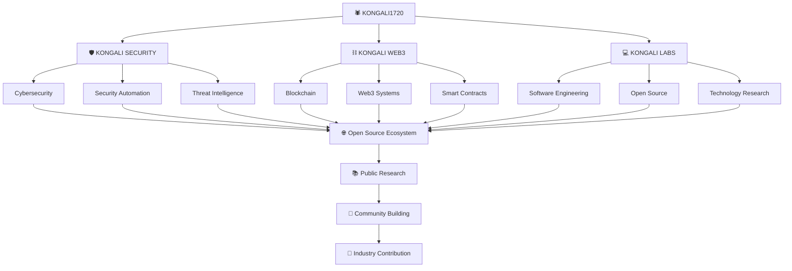

<p align="center">
  
</p>

<div align="center">

# 🕷️ KONGALI SECURITY

### Open-Source Cybersecurity & Security Automation Framework

**Secure. Analyze. Automate.**

[](https://github.com/kongali1720)
[](https://github.com/kongali1720/kongali-security)
[](https://www.python.org/)
[](LICENSE)
[](https://github.com/kongali1720/kongali-security)
[](https://github.com/kongali1720/kongali-security/releases)
[](SECURITY.md)

<br>

[](https://github.com/kongali1720/kongali-security/stargazers)
[](https://github.com/kongali1720/kongali-security/network/members)
[](https://github.com/kongali1720/kongali-security/issues)
[](https://github.com/kongali1720/kongali-security/pulls)
[](https://github.com/kongali1720/kongali-security/commits/main)
[](https://www.python.org/)

</div>

---

<p align="center">
  
</p>

---

# 🕷️ About Kongali Security

**Kongali Security** is an open-source Python project focused on building a modular foundation for defensive cybersecurity analysis and security automation.

The project is being developed with a long-term goal of providing a maintainable and extensible security framework that can help developers, security professionals, system administrators, researchers, students, and open-source contributors build defensive security workflows.

The current implementation represents the **early foundation of the project**. The codebase is intentionally small and modular, allowing new security capabilities to be introduced incrementally without prematurely claiming functionality that is not yet implemented.

The long-term vision includes security analysis, threat intelligence, IOC processing, monitoring, detection engineering, automation, reporting, and AI-assisted security workflows.

> **Current implementation first. Future capabilities are clearly marked as planned.**

---

# 📌 Project Status

> **Active Development — v0.1.0**

Kongali Security is currently in an early development stage.

The project currently focuses on establishing:

* A modular Python package
* Core security processing architecture
* IOC analysis foundations
* Automated testing
* Package building
* Continuous Integration
* Security-oriented CI workflows
* Secure open-source development practices

The APIs, internal architecture, package structure, and CLI interfaces may change during the `0.x` development cycle.

Features described as **planned**, **future**, or **roadmap items** are not necessarily available in the current release.

For the current implementation, always refer to:

* Source code
* Tests
* `pyproject.toml`
* GitHub Actions workflows
* `CHANGELOG.md`
* `ROADMAP.md`

---

# 🎯 Vision

> **Build an open-source security platform that makes cybersecurity analysis, monitoring, and automation more accessible, modular, transparent, and extensible.**

Kongali Security aims to evolve from a small security analysis foundation into a modular cybersecurity ecosystem that can be extended by developers, security researchers, system administrators, educators, and the wider open-source community.

---

# 🚀 Mission

The project is built around the following objectives:

1. Build modular and maintainable security software.
2. Automate repetitive defensive security workflows.
3. Make security analysis more accessible.
4. Provide structured and machine-readable security results.
5. Encourage responsible security research.
6. Promote secure software development practices.
7. Support reproducible and testable security tooling.
8. Build a transparent open-source cybersecurity ecosystem.

---

# 🧠 Current Architecture

The current implementation is intentionally lightweight.

```text
                 KONGALI SECURITY
                         │
                         ▼
              Python Security Package
                         │
              ┌──────────┴──────────┐
              │                     │
              ▼                     ▼
        Core Engine             Analysis
              │                     │
              │                     ▼
              │                IOC Analyzer
              │                     │
              └──────────┬──────────┘
                         │
                         ▼
                  Security Results
                         │
                         ▼
                      Tests
                         │
                         ▼
                 CI / Security CI
```

The architecture is designed to grow incrementally as new security modules are introduced.

---

# 🧩 Current Implementation

## 🔎 IOC Analysis

The current codebase includes an IOC analysis foundation.

The IOC analysis layer is intended to identify and classify common security indicators.

Current and planned IOC categories include:

* IPv4 addresses
* IPv6 addresses
* Domains
* URLs
* MD5 hashes
* SHA-1 hashes
* SHA-256 hashes

The current implementation is focused on establishing a reliable foundation for IOC processing before introducing more advanced enrichment and intelligence capabilities.

Conceptually, the analysis pipeline follows:

```text
Input
  │
  ▼
IOC Analyzer
  │
  ├── Identify
  ├── Classify
  ├── Normalize
  └── Process
        │
        ▼
  Security Result
```

Future versions may extend this pipeline with enrichment, reputation analysis, external intelligence providers, and structured result schemas.

---

## ⚙️ Core Security Engine

The project contains a core engine layer intended to provide a foundation for coordinating security analysis components.

The core architecture is intentionally kept modular so that future capabilities can be integrated without tightly coupling individual security modules.

Future development may introduce:

* Module registration
* Analysis pipelines
* Result handling
* Configuration management
* Plugin interfaces
* Automation workflows

---

# 🧪 Testing

Testing is a core part of the project development process.

The current repository includes automated tests for the implemented security analysis functionality.

Run the complete test suite:

```bash
pytest
```

Run tests with verbose output:

```bash
pytest -v
```

The project is intended to maintain a test-driven approach as additional security modules are introduced.

Future test coverage may include:

* Unit tests
* Integration tests
* Regression tests
* Security-focused tests
* Cross-version Python testing
* Package installation tests

---

# 🔄 Continuous Integration

Kongali Security uses GitHub Actions to automate project validation.

The CI workflow is responsible for validating project changes and helping maintain code quality across contributions.

Typical CI validation may include:

* Python environment setup
* Dependency installation
* Test execution
* Linting
* Static checks
* Package validation

The repository also includes a dedicated security workflow for security-oriented checks.

Workflow files:

```text
.github/
└── workflows/
    ├── ci.yml
    └── security.yml
```

CI and security workflows are considered part of the project's software supply-chain and security boundary.

Contributors should ensure that changes pass the relevant automated checks before opening a Pull Request.

---

# 📦 Python Package

Kongali Security is structured as a Python package.

The package is configured through:

```text
pyproject.toml
```

The project can be installed in editable development mode using:

```bash
python -m pip install -e .
```

The package can also be built using standard Python packaging tools.

Build artifacts are generated into:

```text
dist/
```

Generated build artifacts should not be committed to the Git repository.

---

# 🏗️ Project Structure

The current repository structure is intentionally minimal and reflects the actual early-stage implementation.

```text
kongali-security/
│
├── .github/
│   └── workflows/
│       ├── ci.yml
│       └── security.yml
│
├── kongali_security/
│   ├── __init__.py
│   ├── analysis/
│   │   └── ioc.py
│   └── core/
│       ├── __init__.py
│       └── engine.py
│
├── tests/
│   └── test_ioc.py
│
├── ACKNOWLEDGEMENTS.md
├── CHANGELOG.md
├── CITATION.cff
├── CODE_OF_CONDUCT.md
├── CONTRIBUTING.md
├── FAQ.md
├── GLOSSARY.md
├── GOVERNANCE.md
├── LEARNING_PATH.md
├── LICENSE
├── README.md
├── ROADMAP.md
├── SECURITY.md
├── SUPPORT.md
├── pyproject.toml
└── seminar-cyber-BANNER.png
```

The repository structure will evolve as additional modules are implemented.

---

# ⚙️ Installation

## Requirements

* Python 3.10 or newer
* pip
* Git
* Python virtual environment support

Clone the repository:

```bash
git clone https://github.com/kongali1720/kongali-security.git
```

Enter the project directory:

```bash
cd kongali-security
```

Create a virtual environment:

```bash
python3 -m venv .venv
```

Activate the environment on Linux/macOS:

```bash
source .venv/bin/activate
```

Activate the environment on Windows PowerShell:

```powershell
.venv\Scripts\Activate.ps1
```

Upgrade packaging tools:

```bash
python -m pip install --upgrade pip
```

Install the project in editable mode:

```bash
python -m pip install -e .
```

Verify the Python environment:

```bash
which python
```

On Windows:

```powershell
where.exe python
```

Verify the Python version:

```bash
python --version
```

---

# 🧪 Development Setup

For development work, activate the virtual environment first:

```bash
source .venv/bin/activate
```

Then install the project:

```bash
python -m pip install -e .
```

Run the test suite:

```bash
pytest
```

Run tests with verbose output:

```bash
pytest -v
```

Run linting when configured:

```bash
ruff check .
```

Run static type checking when configured:

```bash
mypy .
```

Build the Python package:

```bash
python -m build
```

The resulting artifacts will be created in:

```text
dist/
```

---

# 📦 Package Build Verification

To verify that the project can be packaged successfully:

```bash
python -m build
```

After a successful build, you should see artifacts similar to:

```text
dist/
├── kongali_security-0.1.0.tar.gz
└── kongali_security-0.1.0-py3-none-any.whl
```

The exact filenames may change as the project version evolves.

To inspect the generated distribution files:

```bash
ls -lah dist/
```

To verify the package installation in the active virtual environment:

```bash
python -m pip install dist/*.whl
```

---

# 💻 Command Line Interface

A dedicated public CLI is part of the project's planned development direction.

The following commands represent the **planned CLI architecture** and should not be considered guaranteed to exist in the current `v0.1.0` implementation:

```bash
kongali-security --help
```

Planned IOC analysis:

```bash
kongali-security ioc example.com
```

Planned hash analysis:

```bash
kongali-security hash <HASH>
```

Planned DNS analysis:

```bash
kongali-security dns example.com
```

Planned structured output:

```bash
kongali-security ioc example.com --format json
```

Until the CLI is officially implemented, users should interact with the Python package and its modules according to the current source code and documentation.

---

# 📊 Standard Security Result

Kongali Security aims to provide consistent machine-readable results across security modules.

The following represents a **future target format**:

```json
{
  "tool": "kongali-security",
  "version": "0.1.0",
  "module": "ioc_analyzer",
  "timestamp": "2026-07-22T00:00:00Z",
  "input": "example.com",
  "type": "domain",
  "findings": [],
  "risk": "low",
  "confidence": 0.99
}
```

This format is currently a conceptual target rather than a guaranteed stable schema.

Future versions may introduce a formally versioned security result specification to improve interoperability between modules and external security systems.

---

# 🔌 Planned Modular Architecture

The long-term architecture is designed to support multiple security capabilities.

```text
                     KONGALI SECURITY
                            │
                            ▼
                    CORE SECURITY ENGINE
                            │
          ┌─────────────────┼─────────────────┐
          │                 │                 │
          ▼                 ▼                 ▼
       Analysis          Threat Intel       OSINT
          │                 │                 │
          ▼                 ▼                 ▼
      Detection         Enrichment         Research
          │                 │                 │
          └─────────────────┼─────────────────┘
                            │
                            ▼
                    Security Automation
                            │
                            ▼
                     Reporting Layer
                            │
                            ▼
                    External Integrations
```

Planned modules may include:

* Threat intelligence
* IOC enrichment
* DNS intelligence
* OSINT
* Hash analysis
* URL analysis
* Log analysis
* Network monitoring
* File integrity monitoring
* YARA analysis
* Security reporting
* Detection engineering
* Automation pipelines
* AI-assisted security analysis

These capabilities will be introduced incrementally and documented only after implementation.

---

# 🤖 Planned AI-SOC Layer

AI-assisted security analysis is part of the project's long-term vision.

The planned architecture follows a Human-in-the-Loop model:

```text
SECURITY EVENT
      │
      ▼
DETECTION ENGINE
      │
      ▼
   AI-SOC
      │
  ┌───┼────────┐
  │   │        │
  ▼   ▼        ▼
Explain Summarize Enrich
  │   │        │
  └───┼────────┘
      │
      ▼
HUMAN ANALYST
      │
      ▼
FINAL DECISION
```

The intended role of AI is to assist analysts with:

* Context
* Summarization
* Enrichment
* Explanation
* Recommendation

AI-generated results should not be treated as authoritative security decisions.

Human analysts should validate important findings before taking consequential actions.

Future AI capabilities may include:

* AI-assisted IOC enrichment
* Security event summarization
* Detection explanation
* Alert prioritization
* Analyst assistance
* LLM security guardrails
* Human approval workflows

---

# 🛡️ Defensive Security Philosophy

Kongali Security follows a **Defensive Security First** philosophy.

The project focuses on:

* Detection
* Monitoring
* Analysis
* Threat Intelligence
* Security Automation
* Incident Response
* Defensive Research
* Secure Software Development

The software is intended for:

* Systems owned by the operator
* Authorized security testing
* Systems where explicit permission has been granted
* Defensive security research
* Educational environments
* Controlled laboratory environments

Users are responsible for complying with applicable laws, regulations, contracts, terms of service, and organizational policies.

---

# 🔒 Security Best Practices

Users and contributors should follow secure development practices.

Never commit:

* API keys
* Passwords
* Authentication tokens
* Private keys
* Cloud credentials
* Production secrets

Use secure secret-management mechanisms such as:

* Environment variables
* GitHub Actions Secrets
* Dedicated secret-management systems
* Platform-specific credential stores

Additional recommendations:

* Validate external input.
* Treat external data as untrusted.
* Apply least-privilege principles.
* Review dependencies before adding them.
* Keep dependencies updated.
* Review CI/CD permissions.
* Avoid unsafe command execution.
* Protect sensitive configuration.
* Use authorized environments for security testing.
* Run relevant tests before submitting changes.

---

# 🤝 Contributing

Contributions are welcome.

Before opening a Pull Request:

1. Update your branch with the latest `main`.
2. Run the relevant tests.
3. Run linting and security checks where applicable.
4. Review your own changes.
5. Remove debugging code.
6. Ensure no secrets or credentials are included.
7. Update documentation when required.
8. Keep changes focused and clearly described.
9. Follow the project's security and contribution guidelines.

A typical contribution workflow is:

```bash
git checkout main
git pull --rebase origin main
```

Create or switch to your working branch:

```bash
git checkout -b feature/my-change
```

Run tests:

```bash
pytest
```

Run linting:

```bash
ruff check .
```

Review changes:

```bash
git status
git diff
```

Stage changes:

```bash
git add .
```

Commit:

```bash
git commit -m "feat: describe your change"
```

Push your branch:

```bash
git push -u origin feature/my-change
```

Then open a Pull Request on GitHub.

Before opening a Pull Request, make sure the branch is synchronized with the latest `main` and that the relevant CI and security checks pass.

Please read:

* [CONTRIBUTING.md](CONTRIBUTING.md)
* [CODE_OF_CONDUCT.md](CODE_OF_CONDUCT.md)
* [GOVERNANCE.md](GOVERNANCE.md)
* [SECURITY.md](SECURITY.md)
* [SUPPORT.md](SUPPORT.md)

---

# 🔄 Development Roadmap

The complete roadmap is maintained in:

**[ROADMAP.md](ROADMAP.md)**

The following milestones summarize the project's long-term direction.

## v0.1.x — Foundation

* [x] Project initialization
* [x] Python package structure
* [x] Core engine foundation
* [x] IOC analysis foundation
* [x] Initial unit tests
* [x] `pyproject.toml` packaging configuration
* [x] Package build verification
* [x] `.gitignore`
* [x] Continuous Integration workflow
* [x] Security workflow foundation
* [ ] Expand test coverage
* [ ] Improve documentation
* [ ] Establish stable internal APIs

---

## v0.2.x — Analysis Expansion

* [ ] IOC normalization
* [ ] IOC enrichment
* [ ] URL analysis
* [ ] Hash analysis improvements
* [ ] Domain analysis
* [ ] Structured security results
* [ ] Improved reporting
* [ ] Expanded automated testing

---

## v0.3.x — Intelligence & OSINT

* [ ] DNS intelligence
* [ ] WHOIS integration
* [ ] Domain intelligence
* [ ] Subdomain analysis
* [ ] Threat intelligence adapters
* [ ] Reputation integrations

---

## v0.4.x — Detection & Monitoring

* [ ] Detection rules
* [ ] Log analysis
* [ ] Network monitoring
* [ ] File integrity monitoring
* [ ] YARA integration
* [ ] Security event correlation

---

## v0.5.x — Automation & AI-SOC

* [ ] Security automation pipelines
* [ ] AI-assisted analysis
* [ ] IOC enrichment
* [ ] Alert summarization
* [ ] Security event explanation
* [ ] Human-in-the-loop workflows
* [ ] AI safety and guardrails

---

## v1.0.0 — Stable Release

* [ ] Stable API
* [ ] Stable CLI
* [ ] Plugin architecture
* [ ] Comprehensive documentation
* [ ] Production-ready security model
* [ ] Community contribution ecosystem
* [ ] Versioned security result schemas
* [ ] Security hardening review
* [ ] Long-term maintenance strategy

---

# 🗺️ Long-Term Vision

```text
                    KONGALI1720
                         │
                         ▼
                 KONGALI SECURITY
                         │
          ┌──────────────┼──────────────┐
          │              │              │
          ▼              ▼              ▼
      Analysis       Threat Intel      OSINT
          │              │              │
          └──────────────┼──────────────┘
                         │
                         ▼
                 Detection Engineering
                         │
                         ▼
                  Security Automation
                         │
                         ▼
                      AI-SOC
                         │
                         ▼
                    Open Source
                         │
                         ▼
                     Community
                         │
                         ▼
                  Public Research
                         │
                         ▼
               Technical Publications
                         │
                         ▼
                Industry Contribution
```

The long-term goal is to build a transparent, secure, modular, and community-driven cybersecurity ecosystem.

---

# 🌐 KONGALI1720 TECHNOLOGY ECOSYSTEM

Kongali Security is part of the broader **KONGALI1720 technology ecosystem**, focused on:

* Cybersecurity
* Security Automation
* Blockchain Technology
* Software Engineering
* Open Source
* Security Research



---

# 📚 Documentation

Project documentation is continuously evolving.

Current project documentation includes:

* [CONTRIBUTING.md](CONTRIBUTING.md)
* [CODE_OF_CONDUCT.md](CODE_OF_CONDUCT.md)
* [GOVERNANCE.md](GOVERNANCE.md)
* [ROADMAP.md](ROADMAP.md)
* [SECURITY.md](SECURITY.md)
* [SUPPORT.md](SUPPORT.md)
* [CHANGELOG.md](CHANGELOG.md)
* [CITATION.cff](CITATION.cff)
* [FAQ.md](FAQ.md)
* [GLOSSARY.md](GLOSSARY.md)
* [LEARNING_PATH.md](LEARNING_PATH.md)
* [ACKNOWLEDGEMENTS.md](ACKNOWLEDGEMENTS.md)

Future documentation may include:

```text
docs/
├── architecture.md
├── installation.md
├── configuration.md
├── cli.md
├── modules.md
└── security-model.md
```

These documents will be added as the corresponding features and architecture become sufficiently mature.

---

# 🏆 Project Goals

Kongali Security aims to become:

```text
Accessible
    +
Modular
    +
Secure
    +
Extensible
    +
Open Source
    +
Community Driven
    +
Automation Ready
    +
Developer Friendly
```

The project is being developed with a long-term goal of becoming a useful contribution to the cybersecurity and open-source ecosystem.

---

# 📜 License

Kongali Security is released under the **MIT License**.

See the [LICENSE](LICENSE) file for the complete license text.

---

# 🛡️ Responsible Disclosure

If you discover a potential security vulnerability in Kongali Security, please follow the responsible disclosure process described in:

**[SECURITY.md](SECURITY.md)**

Please do not publicly disclose sensitive vulnerabilities before maintainers have had an opportunity to investigate and address them.

For general questions and non-sensitive issues, please use the appropriate support channels described in:

* [SUPPORT.md](SUPPORT.md)
* GitHub Issues
* GitHub Discussions, when available

---

# ⚠️ Disclaimer

Kongali Security is provided for legitimate defensive security, authorized testing, research, and educational purposes.

The maintainers are not responsible for misuse of the software.

Users must ensure that they have appropriate authorization before analyzing systems, networks, domains, files, or data.

Always comply with applicable laws, regulations, contracts, terms of service, and organizational security policies.

---

# 🕷️ About the Project

**Kongali Security** is developed under the **KONGALI1720** technology identity with a focus on:

* Cybersecurity
* Security Automation
* Blockchain Technology
* Software Engineering
* Open Source
* Security Research

The project is built around a long-term vision:

> **Build useful technology. Share knowledge. Improve security. Contribute to open source.**

---

<div align="center">

# 🕷️ KONGALI SECURITY

### Secure. Analyze. Automate.

**Built for Defensive Security & Open Source**

<br>

[⭐ Star the Repository](https://github.com/kongali1720/kongali-security)

[🐛 Report an Issue](https://github.com/kongali1720/kongali-security/issues)

[🤝 Contribute](https://github.com/kongali1720/kongali-security/pulls)

<br>

**KONGALI1720 © 2026**

</div>

---

<div align="center">
  
## ☕ Support the Project

If this project has helped your research, learning, or security operations, consider supporting its continued development.

<div align="center">

<a href="https://www.paypal.com/paypalme/bungtempong99">

</a>

</div>

---
